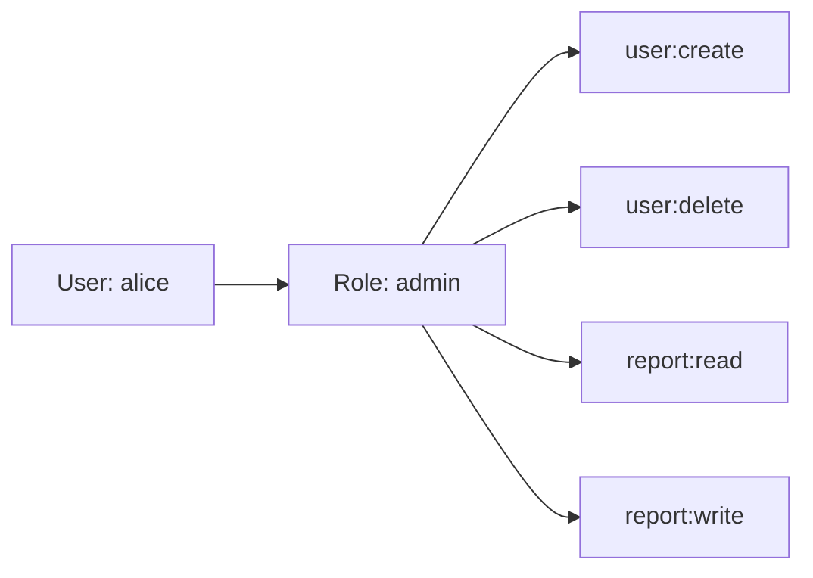
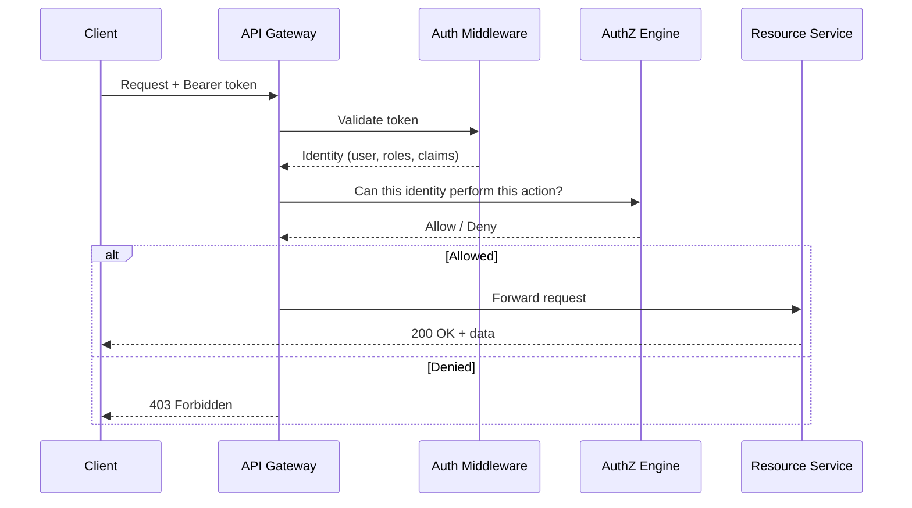

[← Back to README](README.md)

# 01 — Authentication vs Authorization

> **Authentication (AuthN)** answers: *Who are you?*
> **Authorization (AuthZ)** answers: *What are you allowed to do?*

---

## Table of Contents
- [Core Definitions](#core-definitions)
- [Real-World Analogy](#real-world-analogy)
- [Key Differences](#key-differences)
- [Authentication Factors](#authentication-factors)
- [Authentication Methods](#authentication-methods)
- [Authorization Models](#authorization-models)
  - [ACL — Access Control List](#acl--access-control-list)
  - [RBAC — Role-Based Access Control](#rbac--role-based-access-control)
  - [ABAC — Attribute-Based Access Control](#abac--attribute-based-access-control)
  - [PBAC — Policy-Based Access Control](#pbac--policy-based-access-control)
  - [ReBAC — Relationship-Based Access Control](#rebac--relationship-based-access-control)
- [AuthN and AuthZ in a Request Lifecycle](#authn-and-authz-in-a-request-lifecycle)
- [Common Pitfalls](#common-pitfalls)
- [Interview Questions for This Topic](#interview-questions-for-this-topic)

---

## Core Definitions

| Concept | Definition | Question it Answers |
|---------|-----------|---------------------|
| **Authentication (AuthN)** | The process of verifying the identity of a user or system | *Who are you?* |
| **Authorization (AuthZ)** | The process of determining what an authenticated identity is permitted to do | *What can you do?* |
| **Identity** | A unique representation of a user, service, or device | — |
| **Principal** | The entity being authenticated (user, service account, device) | — |
| **Credential** | Proof provided to authenticate (password, certificate, token) | — |
| **Permission** | A specific allowed action (e.g., `file:read`, `invoice:delete`) | — |

**Critical rule**: Authentication always comes before authorization. You cannot make an authorization decision without first knowing *who* is making the request.

---

## Real-World Analogy

Think of a corporate building:

1. **Authentication** = Security guard checking your ID badge at the entrance.
   - The guard confirms you are who you claim to be.
2. **Authorization** = The floor access system controlling which floors your badge opens.
   - Your verified identity determines which doors open for you.

If your badge is cloned (identity spoofed), authentication fails. If you sneak into the server room you are not allowed in despite having a valid badge, authorization fails.

---

## Key Differences

| Dimension | Authentication | Authorization |
|-----------|---------------|---------------|
| Purpose | Verify identity | Enforce access policy |
| When | First step | After authentication |
| Input | Credentials (password, token, cert) | Authenticated identity + resource request |
| Output | Identity assertion (user object, token) | Allow / Deny decision |
| Protocols | OIDC, SAML, Kerberos | OAuth 2.0, OPA, Casbin, IAM policies |
| Failure result | 401 Unauthorized | 403 Forbidden |
| Mutable | Rarely changes (you are still you) | Changes frequently (role changed, policy updated) |

> **HTTP Status Codes matter in interviews**:
> - `401 Unauthorized` — you are not authenticated (or your credentials are invalid)
> - `403 Forbidden` — you are authenticated but not authorized

---

## Authentication Factors

Authentication factors are categorized by *type of proof*:

| Factor | Category | Examples |
|--------|----------|----------|
| Password, PIN | **Something you know** | Login password, security question |
| Hardware token, phone | **Something you have** | TOTP app, SMS code, physical security key |
| Fingerprint, face | **Something you are** | Biometrics |
| GPS location, IP range | **Somewhere you are** | Geo-restricted access |
| Behavior pattern | **Something you do** | Typing cadence, mouse movement |

**Single-Factor Authentication (SFA)**: Only one factor — most common, least secure.
**Multi-Factor Authentication (MFA)**: Two or more factors from different categories. → See [09 — MFA](09-mfa.md)

---

## Authentication Methods

### 1. Password-Based Authentication
- User provides username + password
- Server compares against stored hash (bcrypt, Argon2, scrypt — never plaintext or MD5/SHA1)
- Weakest form — susceptible to phishing, brute force, credential stuffing

**Secure password storage**:
```
stored = bcrypt(password, saltRounds=12)
verify = bcrypt.compare(inputPassword, stored)
```

### 2. Token-Based Authentication
- Server issues a signed token (usually JWT) after verifying credentials
- Client sends token on subsequent requests (typically in `Authorization: Bearer <token>` header)
- Stateless — server doesn't need to look up a session
- → See [04 — JWT](04-jwt.md)

### 3. Certificate-Based Authentication (mTLS)
- Client presents an X.509 certificate instead of a password
- Common in service-to-service (machine) auth and high-security environments
- Both parties can mutually authenticate (Mutual TLS / mTLS)

### 4. Federated Authentication
- User's identity is verified by an external trusted party (IdP)
- Your application trusts the IdP and accepts its assertion
- → See [02 — Identity Concepts](02-identity-concepts.md), [08 — SSO](08-sso.md)

### 5. Passwordless Authentication
- Email magic links, FIDO2 security keys, passkeys
- Removes the weakest link (passwords) entirely
- → See [09 — MFA](09-mfa.md)

### 6. API Key Authentication
- Long-lived secret string sent in a header (`X-API-Key`) or query param
- Simple but coarse — no expiry, no user identity, hard to rotate
- Suitable for server-to-server, not for user-facing flows

---

## Authorization Models

### ACL — Access Control List

An ACL is a list attached to a resource specifying which principals can perform which operations.

```
File: /reports/q4.pdf
  alice   → read, write
  bob     → read
  charlie → (none)
```

**Pros**: Simple, fine-grained per-resource control
**Cons**: Does not scale — managing millions of resources × users is impractical
**Used in**: File systems (Linux permissions), AWS S3 bucket policies, network firewalls

---

### RBAC — Role-Based Access Control

Users are assigned **roles**. Roles have **permissions**. Users inherit permissions through roles.

```
Roles:
  admin    → [user:create, user:delete, report:read, report:write]
  editor   → [report:read, report:write]
  viewer   → [report:read]

User assignments:
  alice → admin
  bob   → editor
  carol → viewer
```



**Pros**: Easy to manage at scale, intuitive, auditable
**Cons**: Role explosion in complex systems; doesn't handle contextual decisions well
**Used in**: Most web applications, AWS IAM roles, database roles, Active Directory groups

**Interview tip**: Distinguish between *flat RBAC*, *hierarchical RBAC* (roles inherit from other roles), and *constrained RBAC* (separation of duty rules).

---

### ABAC — Attribute-Based Access Control

Access decisions are based on **attributes** of the subject (user), resource, action, and environment.

```
Policy: Allow access if:
  subject.department == resource.department
  AND subject.clearanceLevel >= resource.sensitivityLevel
  AND environment.time is between 09:00 and 18:00
```

**Pros**: Extremely flexible, context-aware, no role explosion
**Cons**: Complex to implement and debug; policies can conflict
**Used in**: AWS IAM conditions, XACML-based systems, fine-grained cloud policies

**ABAC vs RBAC**:
| | RBAC | ABAC |
|--|------|------|
| Decision basis | Static role assignments | Dynamic attribute evaluation |
| Flexibility | Medium | High |
| Complexity | Low | High |
| Best for | Standard enterprise apps | Fine-grained, contextual policies |

---

### PBAC — Policy-Based Access Control

A superset of ABAC. Policies are written in a declarative language and evaluated centrally. The canonical implementation is **Open Policy Agent (OPA)** with the Rego language.

```rego
# OPA/Rego example
package authz

default allow = false

allow {
  input.method == "GET"
  input.path == ["reports", _]
  input.user.role == "viewer"
}

allow {
  input.user.role == "admin"
}
```

**Used in**: OPA/Gatekeeper (Kubernetes), Styra, Cedar (AWS Verified Permissions)

---

### ReBAC — Relationship-Based Access Control

Access is determined by the **relationship graph** between the subject and the resource.

```
alice owns document:123
bob is a viewer of document:123
carol is a member of group:engineering
group:engineering has editor access to project:xyz
```

**Used in**: Google Zanzibar (powers Google Drive, Calendar), SpiceDB, Ory Keto
**Key insight**: "*Can Alice view document:123?*" is resolved by traversing the relationship graph.

---

## AuthN and AuthZ in a Request Lifecycle



---

## Common Pitfalls

| Pitfall | Description | Mitigation |
|---------|-------------|------------|
| Conflating AuthN and AuthZ | Using a JWT just to check identity then skipping permission checks | Always enforce both layers |
| Storing auth state in the frontend | Trusting client-side role claims | Verify authorization server-side |
| Overly broad roles | `admin` role given to every developer | Principle of least privilege |
| Broken Object Level Authorization (BOLA) | Access `GET /orders/123` without checking if order belongs to the user | Check ownership/relationship at every request |
| Missing function-level auth | Hiding a button in the UI but not protecting the API endpoint | Never rely on UI-only hiding |
| Privilege escalation | User modifies their own JWT payload to add `admin: true` | Always verify token signature server-side |

---

## Interview Questions for This Topic

1. What is the difference between 401 and 403 HTTP status codes?
2. Can authorization happen before authentication? Explain.
3. You have a system where users belong to multiple departments and access depends on their department and time of day. Which access control model would you choose?
4. What is role explosion in RBAC and how do you prevent it?
5. Explain Broken Object Level Authorization with an example.
6. What is the principle of least privilege? How would you apply it in a microservices architecture?

→ Full answers in [12 — Interview Q&A](12-interview-qa.md)

---

## Related Topics
- [02 — Identity Concepts](02-identity-concepts.md) — IdP, SP, and how identity is federated
- [04 — JWT](04-jwt.md) — Token format used to carry identity and claims
- [05 — OAuth 2.0](05-oauth2.md) — Delegated authorization framework
- [09 — MFA](09-mfa.md) — Strengthening the authentication factor
