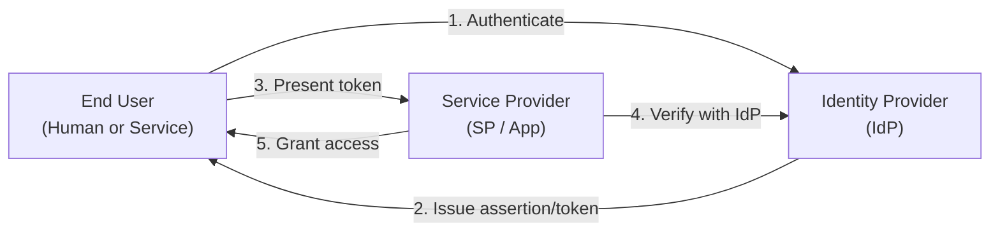
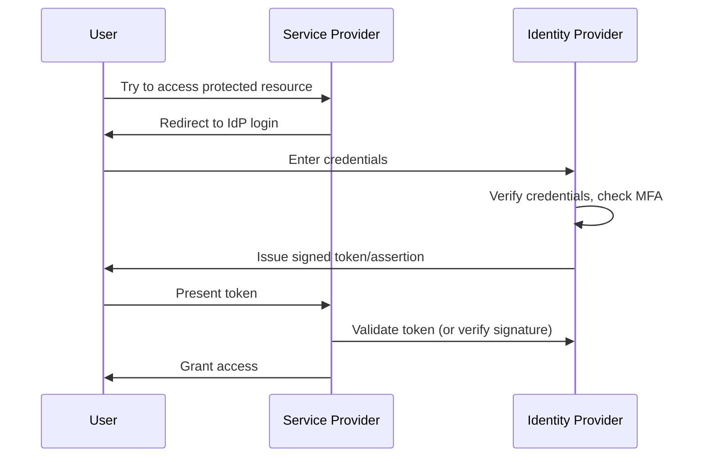
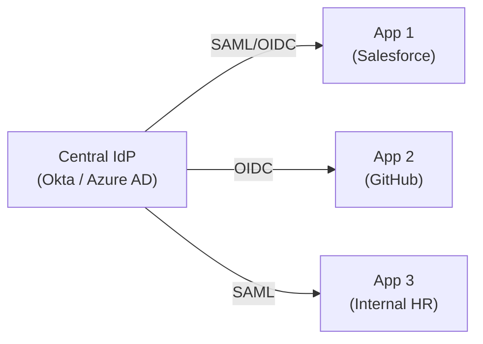
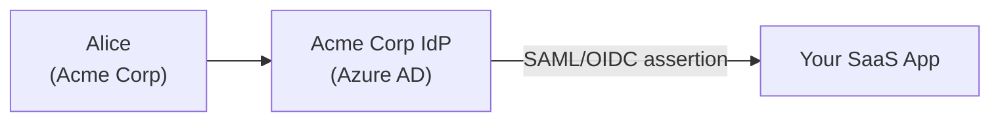
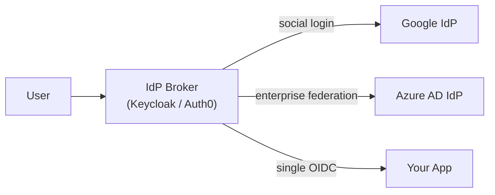

[← Back to README](README.md)

# 02 — Identity Concepts

> Understanding *who* issues, holds, and trusts identity is the foundation of every auth protocol.

---

## Table of Contents
- [Core Actors in an Identity System](#core-actors-in-an-identity-system)
- [Identity Provider (IdP)](#identity-provider-idp)
- [Service Provider (SP) / Relying Party (RP)](#service-provider-sp--relying-party-rp)
- [Identity Federation](#identity-federation)
- [Trust Models](#trust-models)
- [Directory Services](#directory-services)
  - [LDAP](#ldap)
  - [Active Directory (AD)](#active-directory-ad)
  - [Azure Active Directory / Entra ID](#azure-active-directory--entra-id)
  - [Okta, Auth0, Ping Identity](#okta-auth0-ping-identity)
- [Identity Protocols Overview](#identity-protocols-overview)
- [Claims and Attributes](#claims-and-attributes)
- [Tenant and Multi-Tenancy](#tenant-and-multi-tenancy)
- [Common Identity Architecture Patterns](#common-identity-architecture-patterns)
- [Interview Questions for This Topic](#interview-questions-for-this-topic)

---

## Core Actors in an Identity System



| Actor | Role | Examples |
|-------|------|---------|
| **User / Subject** | The entity whose identity is being established | Human user, application, device |
| **Identity Provider (IdP)** | Authenticates the user and issues an identity assertion | Okta, Azure AD, Google, Keycloak |
| **Service Provider (SP)** | The app relying on the IdP's identity assertion (SAML term) | Your web application |
| **Relying Party (RP)** | Same as SP but used in OIDC/OAuth vocabulary | Your web application |
| **Authorization Server (AS)** | Issues access tokens (OAuth 2.0 term — often co-located with IdP) | Keycloak, Auth0, AWS Cognito |
| **Resource Server (RS)** | Hosts the protected resources / APIs | Your backend API |

---

## Identity Provider (IdP)

An **Identity Provider** is the system that:
1. Manages user identities (usernames, passwords, attributes)
2. Authenticates users when they log in
3. Issues trusted assertions about the user's identity to other systems

### What an IdP Does



### IdP Responsibilities
- Credential storage and validation
- MFA enforcement
- User lifecycle management (provision, deprovision)
- Session management
- Issuing and signing identity tokens (SAML assertions, OIDC ID tokens)
- Audit logging of authentication events

### Popular IdPs

| IdP | Type | Protocol Support | Notes |
|-----|------|-----------------|-------|
| **Okta** | Cloud SaaS | OIDC, SAML, OAuth 2.0 | Enterprise standard |
| **Azure AD / Entra ID** | Cloud + Hybrid | OIDC, SAML, WS-Fed | Microsoft ecosystem |
| **Google Identity** | Cloud | OIDC, OAuth 2.0 | Consumer + Workspace |
| **Auth0** | Cloud SaaS | OIDC, SAML, OAuth 2.0 | Developer-friendly |
| **Keycloak** | Self-hosted OSS | OIDC, SAML, OAuth 2.0 | Full control |
| **AWS Cognito** | Cloud | OIDC, OAuth 2.0 | AWS-native |
| **Ping Identity** | Enterprise | OIDC, SAML, WS-Fed | Legacy enterprise |
| **ADFS** | On-premise MS | SAML, WS-Fed, OIDC | Windows-based orgs |

---

## Service Provider (SP) / Relying Party (RP)

The **Service Provider** (SAML term) or **Relying Party** (OIDC term) is the application that:
- Delegates authentication to an IdP
- Receives and validates the identity assertion
- Makes authorization decisions based on the asserted identity

**SP does NOT store passwords** — it offloads that responsibility entirely to the IdP.

### SP Trust Establishment
Before an SP can accept assertions from an IdP, they must establish trust. This happens through:
- **SAML**: Exchanging XML metadata files containing public keys and endpoint URLs
- **OIDC**: SP registers a client_id/client_secret at the IdP; IdP publishes a discovery document at `/.well-known/openid-configuration`

---

## Identity Federation

**Federation** is the ability to use an identity established in one domain (IdP's domain) to access resources in another domain (SP's domain), without the SP needing to manage its own authentication.

### Why Federation Exists
- A company (Acme Corp) uses Okta to manage employee identities
- Acme uses Salesforce, GitHub, and AWS
- Without federation: employees have separate accounts in each system, IT manages N sets of credentials
- With federation: employees log in once to Okta; Okta asserts their identity to all three systems

### Types of Federation

| Type | Description | Protocol |
|------|-------------|---------|
| **Web SSO** | Browser-based federation across web apps | OIDC, SAML |
| **Cross-domain federation** | Two separate organizations trusting each other's IdPs | SAML, WS-Fed |
| **Social login** | Using Google/Facebook as IdP for a consumer app | OIDC |
| **B2B federation** | Partner company's IdP authenticates users for your app | SAML |

---

## Trust Models

### Circle of Trust
A **circle of trust** is a set of IdPs and SPs that have agreed to trust each other's identity assertions. Entities inside the circle accept assertions from one another without requiring separate authentication.

### Chain of Trust
Identity assertions can be chained:
```
User authenticates to corporate IdP
  → Corporate IdP federates to partner IdP
    → Partner IdP issues assertion to SaaS application
```

### Trust Establishment Methods
- **Pre-shared secrets** (OAuth client secret)
- **Certificate exchange** (SAML metadata with X.509 certs)
- **Public key infrastructure** (PKI — JWT RS256/ES256)
- **Well-known discovery documents** (OIDC `.well-known/openid-configuration`)

---

## Directory Services

A **directory service** is the underlying database that stores identity information (users, groups, attributes). It is the source of truth that an IdP queries.

### LDAP

**Lightweight Directory Access Protocol** — a protocol for reading and writing to a directory service.

```
Directory structure (DIT - Directory Information Tree):
dc=example,dc=com
  ou=Users
    cn=Alice Smith      uid=alice, email=alice@example.com, memberOf=cn=Devs
    cn=Bob Jones        uid=bob,   email=bob@example.com, memberOf=cn=Ops
  ou=Groups
    cn=Devs             member: alice, carol
    cn=Ops              member: bob
```

| Concept | Description |
|---------|-------------|
| **DN** | Distinguished Name — unique path to an entry, e.g., `cn=Alice,ou=Users,dc=example,dc=com` |
| **cn** | Common Name |
| **ou** | Organizational Unit |
| **dc** | Domain Component |
| **objectClass** | Schema type (e.g., `inetOrgPerson`, `groupOfNames`) |
| **Bind** | LDAP equivalent of authentication (client sends credentials) |
| **Search** | Query the directory for entries matching a filter |

**LDAP ports**: 389 (unencrypted), 636 (LDAPS — TLS)

**Used by**: Active Directory, OpenLDAP, 389 Directory Server

---

### Active Directory (AD)

**Microsoft Active Directory** is Microsoft's enterprise directory service. It implements LDAP but adds:
- **Kerberos** for authentication (tickets instead of passwords on every request)
- **DNS** integration
- **Group Policy** for configuration management
- **LDAP** for directory queries
- **NTLM** (legacy) for backward compatibility

```
AD structure:
Forest
  └── Domain: corp.example.com
        ├── Organizational Units (OUs)
        │     ├── Users
        │     ├── Computers
        │     └── Groups
        └── Domain Controllers (DCs) — authenticate users, replicate directory
```

**Key concepts**:
| Term | Description |
|------|-------------|
| **Domain Controller (DC)** | Server that runs AD DS and handles authentication |
| **Kerberos TGT** | Ticket Granting Ticket — cached credential for SSO within the domain |
| **Service Principal Name (SPN)** | Identifier for a service in Kerberos |
| **Group Policy Object (GPO)** | Configuration rules applied to computers/users |
| **AD DS** | Active Directory Domain Services |
| **AD FS** | Active Directory Federation Services — adds SAML/WS-Fed/OIDC to AD |

---

### Azure Active Directory / Entra ID

**Azure AD** (rebranded to **Microsoft Entra ID** in 2023) is Microsoft's cloud-based identity platform. It is *not* just AD in the cloud — it is a separate product that:
- Supports modern protocols (OIDC, OAuth 2.0, SAML) natively
- Provides cloud-native identity for Microsoft 365, Azure, and third-party SaaS apps
- Can **sync** with on-premises AD (via **Azure AD Connect**)
- Supports **Conditional Access** (ABAC-style policies)
- Supports **external identities** (B2B guests, B2C customers)

**Azure AD vs On-Prem AD**:
| | On-Prem AD | Azure AD |
|--|-----------|----------|
| Protocol | Kerberos, NTLM, LDAP | OIDC, OAuth 2.0, SAML |
| Access pattern | Domain-joined computers on network | Cloud SaaS via browser/APIs |
| Auth type | Ticket-based (Kerberos) | Token-based (JWT) |
| MFA | RADIUS + NPS | Native Azure MFA |

---

### Okta, Auth0, Ping Identity

These are **Identity-as-a-Service (IDaaS)** platforms — cloud-hosted IdPs with additional features:

| Product | Strengths | Use Case |
|---------|-----------|---------|
| **Okta** | Comprehensive workforce IAM, Universal Directory, 7000+ integrations | Enterprise workforce identity |
| **Auth0** (acquired by Okta) | Developer-friendly, highly customizable, great for B2C | Customer-facing apps |
| **Ping Identity** | Legacy enterprise, high security, on-prem option | Regulated industries |
| **AWS Cognito** | Native AWS integration, free tier | AWS-hosted apps |
| **Keycloak** | Open source, self-hosted, full-featured | Organizations wanting control |

---

## Identity Protocols Overview

| Protocol | Layer | Purpose | Format |
|----------|-------|---------|--------|
| LDAP | Directory | Read/write user data | Binary (BER) |
| Kerberos | AuthN | Ticket-based auth in a domain | Binary tickets |
| SAML 2.0 | AuthN + AuthZ | Federated SSO, enterprise | XML |
| OAuth 2.0 | AuthZ | Delegated authorization | JSON (tokens) |
| OIDC | AuthN (on OAuth) | Federated login, SSO | JSON (JWT) |
| WS-Federation | AuthN | Microsoft-centric federation | XML |

→ Deep dives: [SAML](07-saml.md) · [OAuth 2.0](05-oauth2.md) · [OIDC](06-oidc.md)

---

## Claims and Attributes

An **identity claim** is a statement an IdP makes about a user's identity.

```json
{
  "sub": "user-1234",
  "email": "alice@example.com",
  "name": "Alice Smith",
  "department": "Engineering",
  "roles": ["developer", "team-lead"],
  "iss": "https://idp.example.com",
  "aud": "my-app",
  "exp": 1720000000
}
```

| Claim | Description |
|-------|-------------|
| `sub` | Subject — unique user identifier |
| `iss` | Issuer — which IdP issued this |
| `aud` | Audience — which application this is for |
| `exp` | Expiry timestamp |
| `iat` | Issued at timestamp |
| `email`, `name`, `roles` | Application-specific claims |

**Standard vs Custom claims**: OIDC defines standard claims (name, email, phone). Custom claims carry application-specific data (department, employee_id).

→ See [04 — JWT](04-jwt.md) for how claims are encoded in tokens.

---

## Tenant and Multi-Tenancy

A **tenant** is an isolated group of users sharing a common access configuration. Multi-tenant identity means:

- Each customer organization (tenant) may have their own IdP
- A SaaS product federates with each customer's IdP separately
- Users authenticate via their company's IdP (Okta, Azure AD) → federated into the SaaS product

**Tenant isolation patterns**:
| Pattern | Description |
|---------|-------------|
| Separate databases per tenant | Full isolation, high cost |
| Shared database, tenant_id column | Cost-efficient, requires row-level security |
| Separate identity namespaces | Each tenant has its own user pool/realm |

---

## Common Identity Architecture Patterns

### Pattern 1: Centralized IdP (Hub-and-Spoke)



All applications delegate to one central IdP. Standard enterprise setup.

### Pattern 2: Federated IdPs (B2B)



Your app trusts Acme's IdP. Alice never creates a separate account in your app.

### Pattern 3: IdP Broker / Proxy



Your app integrates with one broker, which handles connections to many upstream IdPs. Simplifies your integration.

---

## Interview Questions for This Topic

1. What is the difference between an Identity Provider and a Service Provider?
2. What is identity federation and why is it valuable?
3. How does LDAP differ from Active Directory?
4. What is the difference between Azure AD and on-premises Active Directory?
5. What are identity claims? Give examples of standard and custom claims.
6. How would you architect identity for a SaaS product serving customers from 50 different enterprises, each with their own Active Directory?

→ Full answers in [12 — Interview Q&A](12-interview-qa.md)

---

## Related Topics
- [03 — Session Management](03-session-management.md)
- [04 — JWT](04-jwt.md)
- [05 — OAuth 2.0](05-oauth2.md)
- [06 — OIDC](06-oidc.md)
- [07 — SAML](07-saml.md)
- [08 — SSO](08-sso.md)
