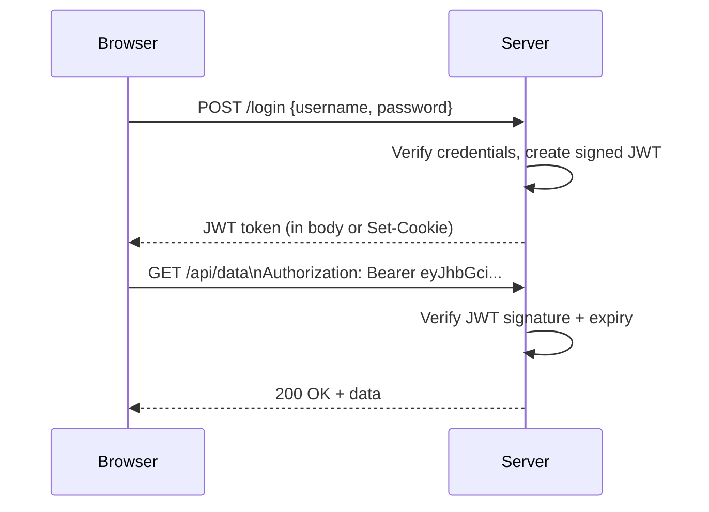

[← Back to README](README.md)

# 03 — Session Management

> Once a user is authenticated, the system must maintain that authenticated state across multiple HTTP requests — this is session management.

---

## Table of Contents
- [The Stateless Problem](#the-stateless-problem)
- [Server-Side Sessions](#server-side-sessions)
- [Client-Side Sessions (Token-Based)](#client-side-sessions-token-based)
- [Cookies Deep Dive](#cookies-deep-dive)
- [Session Expiry Strategies](#session-expiry-strategies)
- [Token Storage Options](#token-storage-options)
- [CSRF — Cross-Site Request Forgery](#csrf--cross-site-request-forgery)
- [Session Fixation](#session-fixation)
- [Session Hijacking](#session-hijacking)
- [Stateful vs Stateless Authentication](#stateful-vs-stateless-authentication)
- [Logout and Session Termination](#logout-and-session-termination)
- [Interview Questions for This Topic](#interview-questions-for-this-topic)

---

## The Stateless Problem

HTTP is a **stateless protocol** — each request is independent with no memory of prior requests. After a user logs in, the server needs a mechanism to recognize the same user on subsequent requests without forcing them to re-authenticate every time.

Two main approaches:
1. **Server-side sessions**: Server stores session state; client holds only a session ID
2. **Token-based (client-side)**: Server issues a signed token containing state; client stores and presents it

---

## Server-Side Sessions

```mermaid
sequenceDiagram
    participant Browser
    participant Server
    participant SessionStore as Session Store (Redis/DB)

    Browser->>Server: POST /login {username, password}
    Server->>Server: Verify credentials
    Server->>SessionStore: Store session {userId, roles, expiry}
    SessionStore-->>Server: sessionId = "abc123"
    Server-->>Browser: Set-Cookie: sessionId=abc123; HttpOnly; Secure

    Browser->>Server: GET /dashboard (Cookie: sessionId=abc123)
    Server->>SessionStore: Lookup sessionId=abc123
    SessionStore-->>Server: {userId: 42, roles: [admin]}
    Server-->>Browser: 200 OK + dashboard data
```

### How It Works
1. User logs in → server verifies credentials
2. Server creates a session record in storage (Redis, DB, memory)
3. Server returns a **session ID** (opaque random string) in a cookie
4. On each subsequent request, browser sends cookie → server looks up session in store
5. Server retrieves user context from the session

### Session Store Options
| Store | Pros | Cons |
|-------|------|------|
| **In-memory** (single server) | Fastest | Lost on server restart; doesn't scale |
| **Redis** | Fast, distributed, TTL support | Additional infrastructure |
| **Database (SQL)** | Durable, queryable | Slower; DB becomes bottleneck |
| **Sticky sessions** (load balancer) | No external store | Single point of failure per user |

### Pros and Cons
| Pros | Cons |
|------|------|
| Easy to revoke (delete session from store) | Requires shared session store for horizontal scaling |
| Session data not exposed to client | Extra network call per request (to session store) |
| Works well for traditional web apps | Does not work well for stateless APIs |

---

## Client-Side Sessions (Token-Based)



### How It Works
1. Server issues a **signed token** (JWT) containing user claims
2. Client stores the token (cookie or localStorage)
3. Client sends token on every request (Authorization header or cookie)
4. Server validates the signature and extracts claims — **no store lookup needed**

### Pros and Cons
| Pros | Cons |
|------|------|
| Stateless — scales horizontally with no shared store | Hard to revoke (token valid until expiry) |
| Self-contained — carries user context | Tokens can grow large |
| Works well for APIs, SPAs, mobile apps | Secret key management is critical |

→ See [04 — JWT](04-jwt.md) for detailed token internals.

---

## Cookies Deep Dive

Cookies are the primary mechanism for persisting session state in browsers.

### Cookie Attributes

| Attribute | Purpose | Best Practice |
|-----------|---------|--------------|
| `HttpOnly` | Prevents JavaScript access to the cookie | **Always set** — prevents XSS cookie theft |
| `Secure` | Cookie only sent over HTTPS | **Always set** in production |
| `SameSite` | Controls cross-site request behavior | Set to `Strict` or `Lax` |
| `Domain` | Which domains receive the cookie | Set explicitly — avoid overly broad domains |
| `Path` | Which paths receive the cookie | Restrict to necessary paths |
| `Max-Age` / `Expires` | When the cookie expires | Set appropriate TTL |

### SameSite Attribute

`SameSite` is one of the most important security attributes:

| Value | Behavior | CSRF Protection | Cross-Site Use |
|-------|----------|-----------------|---------------|
| `Strict` | Cookie sent only on same-site requests | Maximum | Breaks cross-site links |
| `Lax` | Sent on top-level navigation GETs; not on POST | Good | Allows links from other sites |
| `None` | Sent on all requests (requires `Secure`) | None | Required for cross-site embeds/OAuth |

```
Set-Cookie: sessionId=abc123; HttpOnly; Secure; SameSite=Lax; Path=/; Max-Age=3600
```

### Session Cookie vs Persistent Cookie
- **Session cookie**: No `Expires`/`Max-Age` — deleted when browser closes
- **Persistent cookie**: Has `Expires`/`Max-Age` — survives browser restart

---

## Session Expiry Strategies

### Absolute Expiry
Session expires at a fixed time from creation, regardless of activity.
```
Created: 09:00
Expires: 17:00 (8-hour absolute expiry)
→ User active at 16:59 — session still expires at 17:00
```
**Use case**: High-security environments (banking, healthcare)

### Sliding (Idle) Expiry
Session expiry window resets with each activity.
```
Idle timeout: 30 minutes
User last active: 10:00
Session expires: 10:30
User accesses at 10:20 → new expiry: 10:50
```
**Use case**: Consumer applications

### Combination
Many systems use both: sliding window resets on activity, but absolute maximum cap.
```
Absolute max: 24 hours
Idle timeout: 30 minutes
→ Session expires at whichever comes first
```

---

## Token Storage Options

Where should a browser store an auth token? This is a critical security decision:

### Option 1: HttpOnly Cookie
```
Set-Cookie: access_token=eyJhbG...; HttpOnly; Secure; SameSite=Lax
```
| Pros | Cons |
|------|------|
| Not accessible to JavaScript → immune to XSS | Requires CSRF protection |
| Automatically sent with requests | Harder to use with cross-origin APIs |
| Browser manages expiry | Third-party cookie restrictions can complicate OAuth |

### Option 2: localStorage
```javascript
localStorage.setItem('access_token', token);
// On each request:
fetch('/api', { headers: { Authorization: `Bearer ${localStorage.getItem('access_token')}` }});
```
| Pros | Cons |
|------|------|
| Easy to use with SPAs | **Accessible to JavaScript → XSS can steal it** |
| No CSRF concerns | Developer must manage expiry and sending |
| Works across tabs | |

### Option 3: sessionStorage
Same as localStorage but cleared when tab closes.

### Option 4: In-memory (JavaScript variable)
```javascript
let token = null; // stored in module scope
```
| Pros | Cons |
|------|------|
| Not accessible outside JS context | Lost on page refresh |
| Cannot be read by injected scripts in other origins | Requires silent refresh mechanism |

### Recommendation Matrix

| Application Type | Recommended Storage | Reason |
|-----------------|--------------------|----|
| Server-rendered web app | HttpOnly session cookie | Simplest, no XSS risk |
| SPA with backend-for-frontend (BFF) | HttpOnly cookie via BFF | Best security for SPAs |
| SPA talking directly to API | HttpOnly cookie (if same origin) or in-memory | Avoid localStorage for sensitive tokens |
| Mobile native app | OS secure storage (Keychain/Keystore) | Not a browser |
| Server-to-server | In-memory, request credential manager | No browser |

**General rule**: **Never store access tokens in localStorage if you can avoid it.** HttpOnly cookies are the safer default for browser environments.

---

## CSRF — Cross-Site Request Forgery

CSRF is an attack where a malicious website tricks a user's browser into making an authenticated request to a target site.

### How CSRF Works

```mermaid
sequenceDiagram
    participant Alice
    participant Bank as bank.com (victim)
    participant Evil as evil.com (attacker)

    Alice->>Bank: Login to bank.com
    Bank-->>Alice: Set session cookie

    Alice->>Evil: Visit evil.com (e.g., click a link)
    Evil-->>Alice: Page with hidden form:
    Note over Evil: <form action="https://bank.com/transfer" method="POST">
    Note over Evil: <input type="hidden" name="amount" value="10000">

    Alice->>Bank: POST /transfer (browser auto-sends cookie!)
    Bank->>Bank: Sees valid session cookie → processes transfer!
```



### CSRF Mitigations

**1. CSRF Tokens (Synchronizer Token Pattern)**
```html
<form method="POST" action="/transfer">
  <input type="hidden" name="_csrf" value="rAnDoMtOkEn123">
  ...
</form>
```
Server generates a random token, stores it in session, embeds in form. On submit, verifies token matches. An attacker cannot read the token (same-origin policy).

**2. Double Submit Cookie**
Server sends CSRF token as cookie AND expects it in request header. Attacker cannot read cookies from another origin.

**3. SameSite Cookie Attribute**
`SameSite=Strict` or `SameSite=Lax` prevents cookies from being sent on cross-site requests, effectively defeating CSRF for most cases.

**4. Custom Request Headers**
Simple APIs can require a custom header (e.g., `X-Requested-With: XMLHttpRequest`). Browsers only allow custom headers on same-origin requests (without CORS preflight).

**5. Origin / Referer Header Checking**
Server validates that the `Origin` or `Referer` header matches the expected domain.

### CSRF and JWTs
If you use JWT in `Authorization: Bearer` headers (not cookies), **CSRF is not a concern** — browsers do not automatically send `Authorization` headers cross-site. This is one advantage of header-based token delivery.

---

## Session Fixation

**Session Fixation** is an attack where an attacker pre-establishes a session ID and tricks the user into authenticating with that ID.

### Attack Flow
1. Attacker requests a session ID from the server
2. Attacker tricks victim into visiting URL with that session ID (e.g., `https://app.com?sessionid=attacker_known_id`)
3. Victim logs in — if server uses the same session ID after login, attacker now has a valid authenticated session

### Mitigation
**Regenerate the session ID upon successful login** — always issue a new session ID after authentication.

```javascript
// After verifying credentials:
req.session.regenerate((err) => {
  req.session.userId = authenticatedUser.id;
});
```

---

## Session Hijacking

**Session Hijacking** is stealing or guessing a valid session ID to impersonate an authenticated user.

### Common Methods
| Method | Description |
|--------|-------------|
| Network sniffing | Intercepting session ID in transit | → Mitigation: HTTPS only |
| XSS | Injecting JavaScript to read `document.cookie` | → Mitigation: HttpOnly cookies |
| Predictable session IDs | Guessing session IDs from a weak generator | → Mitigation: Cryptographically random IDs (128+ bits) |
| Session fixation (see above) | Forcing a known session ID | → Mitigation: Regenerate on login |

---

## Stateful vs Stateless Authentication

| Dimension | Stateful (Server-Side Session) | Stateless (Token-Based) |
|-----------|-------------------------------|------------------------|
| Session store required | Yes | No |
| Horizontal scaling | Requires shared store | Easy (each server validates independently) |
| Revocation | Immediate (delete session) | Difficult (wait for expiry or maintain blocklist) |
| Payload size | Small (session ID only) | Larger (full claims in token) |
| Database hit per request | Yes (session lookup) | No (signature verification only) |
| Logout | Reliable | "Best effort" (client discards token; token still valid until expiry) |
| Best for | Traditional web apps, high-security | APIs, SPAs, microservices, mobile |

---

## Logout and Session Termination

### Server-Side Session Logout
Simple: delete the session from the store.
```javascript
req.session.destroy(); // Express session
```

### Token-Based Logout
More complex because tokens are stateless:
1. **Client-side only**: Client deletes the token. Token technically still valid until expiry. **Risky for stolen tokens.**
2. **Token blocklist**: Server maintains a blocklist (Redis). On each request, check if token is blocklisted. Reintroduces statefulness.
3. **Short-lived tokens + refresh token rotation**: Keep access tokens short (5-15 min). Revoke the refresh token to prevent issuing new access tokens.

### Federated Logout / Single Logout (SLO)
When using SSO, logging out of one app should propagate to the IdP and all other apps. → See [08 — SSO](08-sso.md)

---

## Interview Questions for This Topic

1. What is the difference between a session cookie and a persistent cookie?
2. Where should you store JWTs in a browser-based application and why?
3. Explain a CSRF attack and three ways to prevent it.
4. Why is it important to regenerate the session ID after login?
5. What are the trade-offs between stateful and stateless authentication?
6. How do you implement logout for a JWT-based auth system?
7. What does `SameSite=Lax` mean on a cookie?

→ Full answers in [12 — Interview Q&A](12-interview-qa.md)

---

## Related Topics
- [04 — JWT](04-jwt.md) — How tokens are structured and signed
- [05 — OAuth 2.0](05-oauth2.md) — Access and refresh token lifecycle
- [09 — MFA](09-mfa.md) — Step-up authentication
- [11 — Real-World Scenarios](11-real-world-scenarios.md) — Attack vector details
