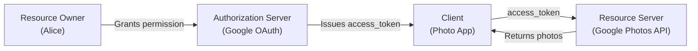
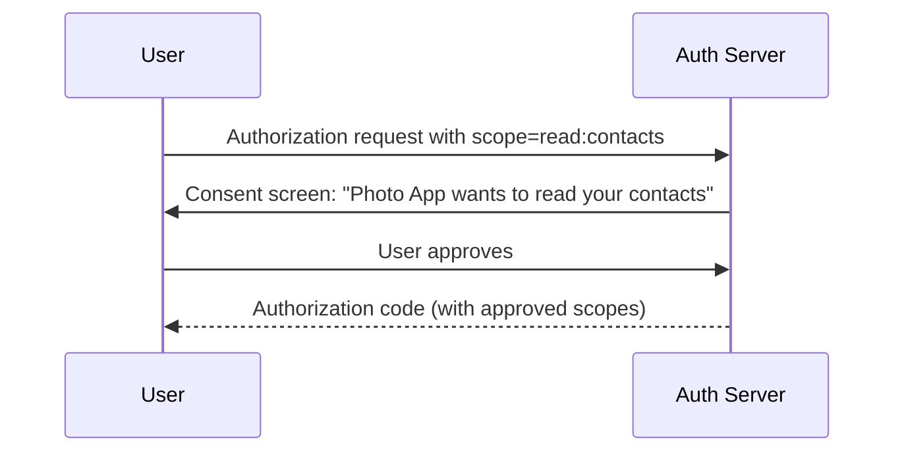
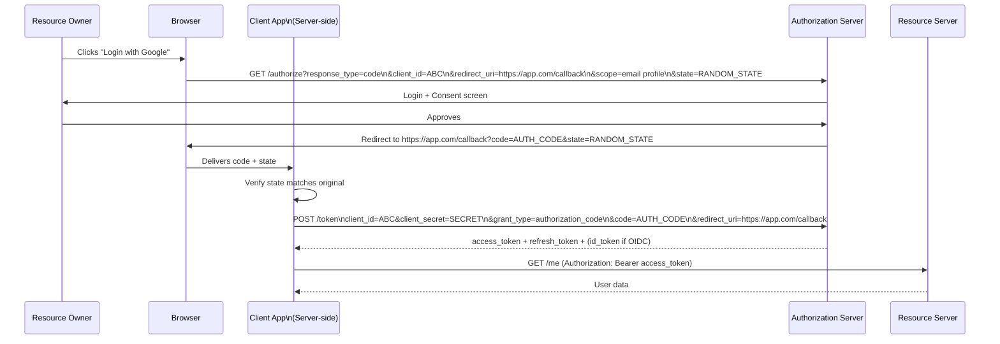
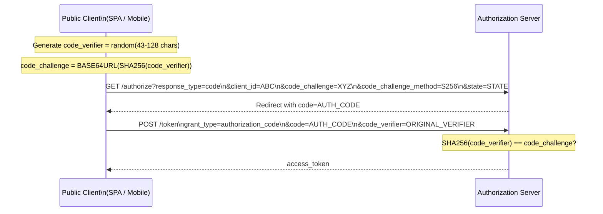
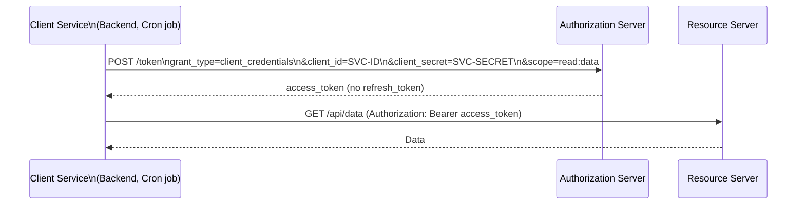
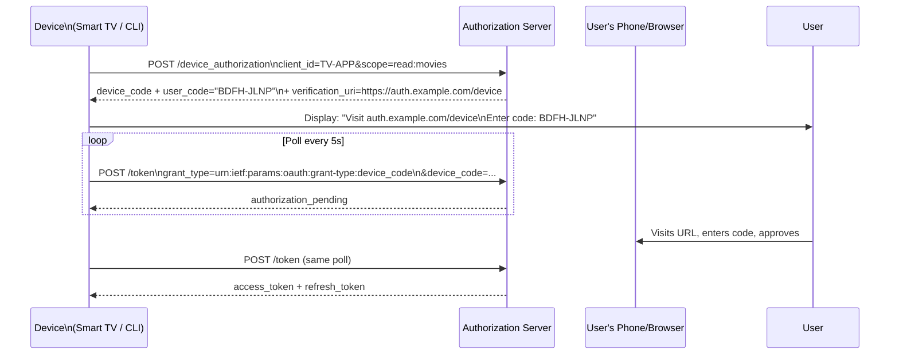
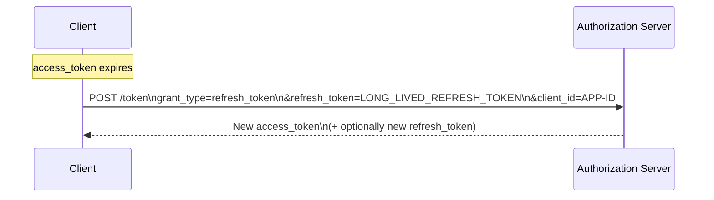

[← Back to README](README.md)

# 05 — OAuth 2.0

> OAuth 2.0 is an **authorization framework** that enables an application to obtain limited access to a resource on behalf of a user, without the user sharing their credentials.

---

## Table of Contents
- [What OAuth 2.0 Is (and Is Not)](#what-oauth-20-is-and-is-not)
- [Core Roles](#core-roles)
- [Tokens in OAuth 2.0](#tokens-in-oauth-20)
- [Scopes](#scopes)
- [Grant Types (Flows)](#grant-types-flows)
  - [Authorization Code Grant](#authorization-code-grant)
  - [Authorization Code + PKCE](#authorization-code--pkce)
  - [Client Credentials Grant](#client-credentials-grant)
  - [Device Authorization Grant](#device-authorization-grant)
  - [Implicit Grant (Deprecated)](#implicit-grant-deprecated)
  - [Resource Owner Password Credentials (Deprecated)](#resource-owner-password-credentials-deprecated)
- [Token Introspection](#token-introspection)
- [Token Revocation](#token-revocation)
- [Refresh Tokens](#refresh-tokens)
- [Dynamic Client Registration](#dynamic-client-registration)
- [OAuth 2.0 Security Considerations](#oauth-20-security-considerations)
- [OAuth 2.1 — What's Changing](#oauth-21--whats-changing)
- [Interview Questions for This Topic](#interview-questions-for-this-topic)

---

## What OAuth 2.0 Is (and Is Not)

| | OAuth 2.0 |
|--|-----------|
| **Is** | A framework for **delegated authorization** — granting limited access to resources |
| **Is** | The foundation that OIDC builds upon for authentication |
| **Is NOT** | An authentication protocol — it doesn't tell you *who* the user is |
| **Is NOT** | A data format (that's JWT) |
| **Is NOT** | A security protocol on its own (requires HTTPS, PKCE, state, etc.) |

**Analogy**: OAuth 2.0 is like giving a valet a key that only opens the car door, not the trunk or house. You grant limited, scoped access without giving full credentials.

---

## Core Roles

| Role | Description | Example |
|------|-------------|---------|
| **Resource Owner** | The user who owns the data | Alice |
| **Client** | The application requesting access | A photo editing app |
| **Authorization Server (AS)** | Issues tokens after authenticating the user | Google's OAuth server |
| **Resource Server (RS)** | Hosts the protected resources/APIs | Google Photos API |



---

## Tokens in OAuth 2.0

| Token | Format | Lifetime | Purpose |
|-------|--------|----------|---------|
| **Access Token** | JWT or opaque string | Short (5–60 min) | Access protected resources |
| **Refresh Token** | Opaque string (recommended) | Long (hours–days) | Obtain new access tokens |
| **Authorization Code** | Short-lived opaque string | 1–10 minutes, single-use | Exchanged at token endpoint for tokens |

---

## Scopes

**Scopes** define the specific permissions the client is requesting. They are space-separated strings.

```
scope=read:photos write:photos profile email
```

The Authorization Server shows the user a **consent screen** listing requested scopes. The user can approve or deny.



**Examples of scope conventions**:
```
# Google
https://www.googleapis.com/auth/calendar.readonly
email profile openid

# GitHub
repo  user  read:org

# Custom API
read:invoices  write:invoices  admin:users
```

**Scope best practices**:
- Use principle of least privilege — request only what you need
- Use resource indicators (RFC 8707) to scope tokens to specific APIs
- Separate admin scopes from user scopes

---

## Grant Types (Flows)

### Authorization Code Grant

The most secure and widely used flow. Used when the client is a **confidential client** (server-side app with a secret).



**Why the code exchange step?**
The auth code is visible in the browser URL/history. If it were the access token, it would be exposed. The code is short-lived and can only be exchanged once, with the client secret.

**State parameter**: A random, unguessable value generated by the client. Returned in callback to prevent CSRF attacks on the OAuth flow.

---

### Authorization Code + PKCE

**PKCE (Proof Key for Code Exchange)** — RFC 7636 — extends Authorization Code flow for **public clients** (SPAs, mobile apps) that cannot securely store a `client_secret`.



**How PKCE prevents interception attacks**:
1. Client generates `code_verifier` (secret random string)
2. Client sends `code_challenge = SHA256(code_verifier)` with auth request
3. Even if attacker intercepts the auth code, they cannot exchange it — they don't know the `code_verifier`
4. Client sends `code_verifier` at token exchange → server verifies the hash matches

**PKCE is now required** for all public clients and recommended for all clients per OAuth 2.1.

---

### Client Credentials Grant

Used for **machine-to-machine** (M2M) authentication. No user involved.



**Key points**:
- No user interaction — the client authenticates as itself
- No refresh token is issued (just get a new access token when it expires)
- Secret should be stored in a secrets manager, not hardcoded
- Use with service accounts, background jobs, microservices

---

### Device Authorization Grant

For devices with limited input capabilities (smart TVs, CLI tools, IoT devices).



---

### Implicit Grant (Deprecated)

Previously used for SPAs — returned access token directly in URL fragment without code exchange.

**Why it's deprecated**:
- Access token exposed in browser history, logs, referrer headers
- No `client_secret`, no PKCE → cannot verify client identity
- Superseded by Authorization Code + PKCE

**Current guidance**: Use Authorization Code + PKCE for all browser-based apps.

---

### Resource Owner Password Credentials (Deprecated)

User enters credentials directly into the client application, which sends them to the authorization server.

**Why it's deprecated**:
- Defeats the purpose of OAuth — the client sees the user's password
- No redirect, no IdP login page → cannot use MFA, social login, etc.
- Was only acceptable for first-party apps with no alternative

**Current guidance**: Never use. Migrate to Authorization Code + PKCE.

---

## Token Introspection

**Token Introspection** (RFC 7662) allows a resource server to query the authorization server to check if a token is valid.

```
POST /introspect
Authorization: Basic base64(client_id:client_secret)
Content-Type: application/x-www-form-urlencoded

token=ACCESS_TOKEN
```

Response:
```json
{
  "active": true,
  "sub": "user-123",
  "scope": "read:photos",
  "exp": 1700003600,
  "client_id": "photo-app"
}
```

**When to use**:
- When access tokens are opaque (not JWTs) — resource server cannot validate locally
- When you need real-time revocation checking (token could be revoked since issue)
- Downside: adds network latency on every request

**Comparison**:
| | JWT local validation | Token introspection |
|--|---------------------|-------------------|
| Network call | None | Yes (each request) |
| Revocation | Only after expiry | Immediate |
| Scalability | Excellent | Depends on AS capacity |

---

## Token Revocation

**Token Revocation** (RFC 7009) allows clients to signal that a token is no longer needed.

```
POST /revoke
Authorization: Basic base64(client_id:client_secret)
Content-Type: application/x-www-form-urlencoded

token=REFRESH_TOKEN&token_type_hint=refresh_token
```

**Typical use**:
- User logs out → revoke refresh token
- User changes password → revoke all refresh tokens
- Security incident → revoke all tokens for a user

**Important**: Revoking an access token does not immediately make it invalid for JWT validation (it's self-contained). Systems that need immediate revocation should:
1. Use short-lived access tokens (5-15 min TTL)
2. Maintain a token blocklist (checked on each request)

---

## Refresh Tokens

Refresh tokens allow clients to obtain new access tokens without requiring user re-authentication.



### Refresh Token Rotation
Best practice: issue a **new refresh token** each time one is used (and invalidate the old one).

**Why**: If a refresh token is stolen, the attacker uses it once. The legitimate client then uses the old token → AS detects reuse → AS revokes the entire token family → attack contained.

```
Initial:  refresh_token = RT-1
Client uses RT-1 → gets access_token + RT-2 (RT-1 now invalid)
Client uses RT-2 → gets access_token + RT-3 (RT-2 now invalid)

Attacker steals RT-2 and uses it:
  AS sees RT-2 already used → suspicious! Revoke entire family
```

### Refresh Token Scope
- Refresh tokens should be stored securely (not in localStorage)
- Typically stored as HttpOnly cookies or in server-side session
- Should be single-use with rotation

---

## Dynamic Client Registration

OAuth 2.0 supports **dynamic client registration** (RFC 7591), allowing clients to register programmatically with the authorization server.

```
POST /register
Content-Type: application/json

{
  "client_name": "My App",
  "redirect_uris": ["https://app.example.com/callback"],
  "grant_types": ["authorization_code"],
  "response_types": ["code"],
  "scope": "email profile"
}
```

Used in OIDC discovery for automatic configuration of clients against new IdPs.

---

## OAuth 2.0 Security Considerations

| Threat | Mitigation |
|--------|-----------|
| Authorization code interception | PKCE — always, even for confidential clients |
| CSRF on redirect | `state` parameter — random, unpredictable, verified on callback |
| Open redirect | Validate `redirect_uri` exactly (not prefix match) |
| Token leakage in logs/referrer | Use fragment responses or PKCE; avoid `response_type=token` |
| Client secret exposure | Use secrets manager; rotate regularly; never in source code |
| Phishing for credentials | Authorization Code flow with redirect to official IdP |
| Mix-up attack | Use `iss` parameter in auth response (RFC 9207) |
| Token replay | `jti` in JWT + blocklist for high-security scenarios |

---

## OAuth 2.1 — What's Changing

OAuth 2.1 consolidates OAuth 2.0 + security best practices into a single document:

| Change | Details |
|--------|---------|
| PKCE required | For all clients, not just public clients |
| Implicit grant removed | No longer part of the spec |
| ROPC grant removed | No longer part of the spec |
| Refresh token rotation required | For public clients |
| Redirect URI exact match | No wildcard or prefix matching |

---

## Interview Questions for This Topic

1. What is the difference between OAuth 2.0 and authentication? Why can't you use OAuth for login without OIDC?
2. Explain the Authorization Code + PKCE flow step by step.
3. What is the `state` parameter and what attack does it prevent?
4. When would you use Client Credentials grant vs Authorization Code grant?
5. Why is the Implicit grant deprecated?
6. What is refresh token rotation and why does it improve security?
7. What is token introspection and when would you use it vs local JWT validation?
8. How do scopes limit access in OAuth 2.0?

→ Full answers in [12 — Interview Q&A](12-interview-qa.md)

---

## Related Topics
- [04 — JWT](04-jwt.md) — Access token format
- [06 — OIDC](06-oidc.md) — Authentication layer built on OAuth 2.0
- [08 — SSO](08-sso.md) — SSO patterns using OIDC
- [11 — Real-World Scenarios](11-real-world-scenarios.md) — OAuth in microservices
