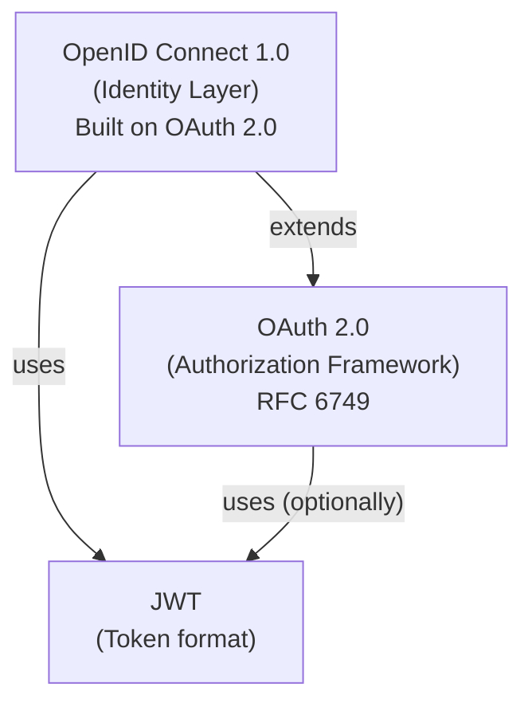
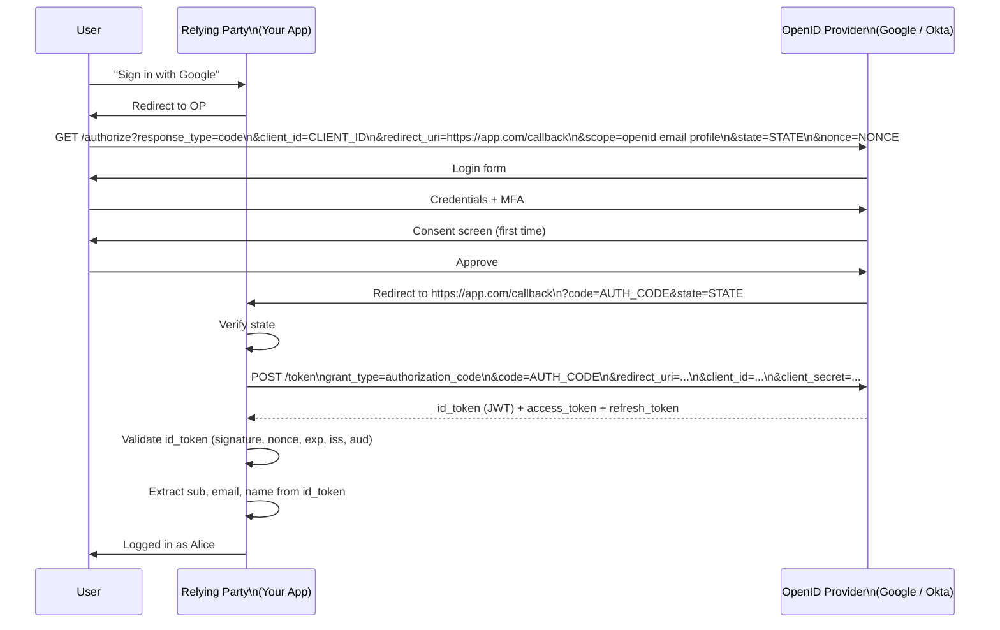
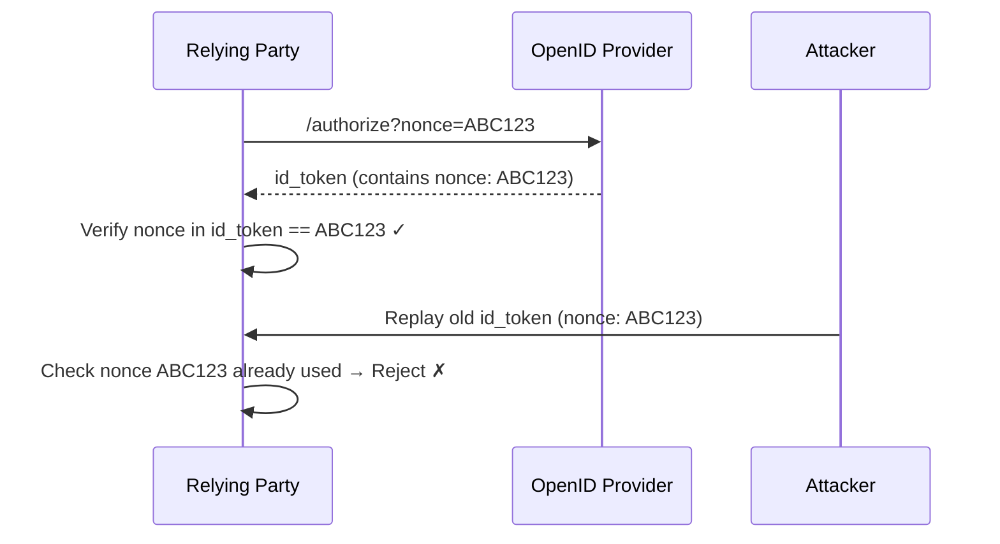
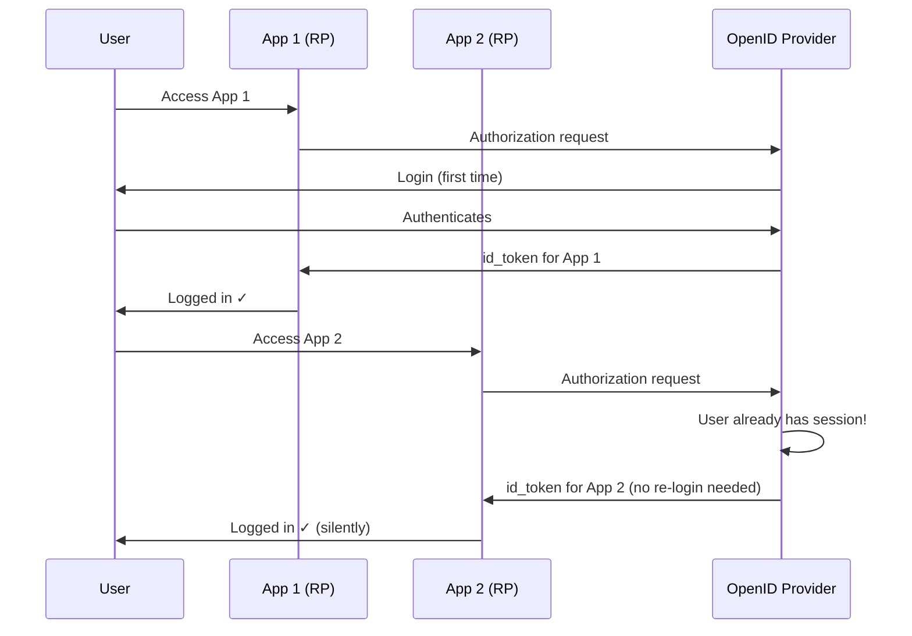

[← Back to README](README.md)

# 06 — OpenID Connect (OIDC)

> OpenID Connect is an **identity layer built on top of OAuth 2.0** that adds authentication — answering the question *Who is this user?* — to OAuth's authorization framework.

---

## Table of Contents
- [Why OIDC Exists](#why-oidc-exists)
- [OIDC vs OAuth 2.0](#oidc-vs-oauth-20)
- [Core Concepts](#core-concepts)
- [The ID Token](#the-id-token)
- [Standard Claims](#standard-claims)
- [OIDC Flows](#oidc-flows)
  - [Authorization Code Flow (most common)](#authorization-code-flow-most-common)
  - [Hybrid Flow](#hybrid-flow)
  - [Implicit Flow (deprecated)](#implicit-flow-deprecated)
- [UserInfo Endpoint](#userinfo-endpoint)
- [Discovery Document](#discovery-document)
- [JWKS Endpoint](#jwks-endpoint)
- [Nonce](#nonce)
- [OIDC Scopes](#oidc-scopes)
- [OIDC and SSO](#oidc-and-sso)
- [Token Validation in OIDC](#token-validation-in-oidc)
- [OIDC for Social Login](#oidc-for-social-login)
- [Interview Questions for This Topic](#interview-questions-for-this-topic)

---

## Why OIDC Exists

OAuth 2.0 grants access to resources but does not define how to identify the user. After obtaining an access token, you know the client has permission to access a resource — but you don't know *who the user is*.

Before OIDC, developers hacked around this by:
- Using access tokens to call a proprietary `/userinfo` endpoint (non-standard)
- Using the Facebook Graph API, Google+ API, etc. (each different)
- Building custom "login with" integrations per provider

**OIDC standardizes this**: a single protocol, interoperable across all compliant providers.

---

## OIDC vs OAuth 2.0



| Dimension | OAuth 2.0 | OIDC |
|-----------|-----------|------|
| Purpose | Delegated authorization | Authentication + authorization |
| Answers | *What can this client do?* | *Who is this user?* |
| Token added | access_token, refresh_token | **id_token** (+ access_token, refresh_token) |
| User identity | Not defined | **ID Token contains user identity** |
| Standardized scopes | No | Yes: `openid`, `profile`, `email`, `phone`, `address` |
| User info endpoint | Not defined | **Standardized `/userinfo` endpoint** |
| Discovery | Not defined | **Standardized discovery document** |

---

## Core Concepts

| Concept | Description |
|---------|-------------|
| **OpenID Provider (OP)** | The OIDC identity server (equivalent to OAuth 2.0 AS + user identity) |
| **Relying Party (RP)** | The application using OIDC (equivalent to OAuth 2.0 client) |
| **ID Token** | A JWT containing the user's identity claims — the authentication result |
| **Access Token** | OAuth 2.0 access token — used to call APIs (including UserInfo endpoint) |
| **UserInfo Endpoint** | API endpoint that returns user claims given a valid access token |
| **Discovery Document** | JSON document at `/.well-known/openid-configuration` describing the OP's endpoints |

---

## The ID Token

The **ID Token** is the key addition OIDC makes to OAuth 2.0. It is a **JWT** (always) that carries the user's identity:

```json
{
  "iss": "https://accounts.google.com",
  "sub": "110169484474386276334",
  "aud": "your-client-id.apps.googleusercontent.com",
  "exp": 1700003600,
  "iat": 1700000000,
  "auth_time": 1699999800,
  "nonce": "RANDOM_NONCE_VALUE",
  "email": "alice@gmail.com",
  "email_verified": true,
  "name": "Alice Smith",
  "picture": "https://lh3.googleusercontent.com/...",
  "locale": "en",
  "at_hash": "HK6E_P6Dh8Y93mRNtsDB1Q"
}
```

### ID Token vs Access Token

| | ID Token | Access Token |
|--|----------|-------------|
| Purpose | Identify the user (for the RP) | Access protected resources (for the RS) |
| Format | Always JWT | JWT or opaque |
| Audience | The Relying Party (client app) | The Resource Server (API) |
| Who validates | The RP (client) | The RS (API) |
| Contains | User identity claims | Authorization claims (scopes, permissions) |
| Should you call APIs with it? | **No** — use access token | **Yes** |

---

## Standard Claims

OIDC defines standard claim names across all providers:

| Scope | Claims Returned |
|-------|----------------|
| `openid` (required) | `sub` (unique user ID) |
| `profile` | `name`, `given_name`, `family_name`, `middle_name`, `nickname`, `preferred_username`, `profile`, `picture`, `website`, `gender`, `birthdate`, `zoneinfo`, `locale`, `updated_at` |
| `email` | `email`, `email_verified` |
| `address` | `address` (structured object) |
| `phone` | `phone_number`, `phone_number_verified` |

**Important**: The `sub` claim is the stable, unique identifier for a user. Use `sub` (not `email`) as the user identifier in your database — emails can change.

---

## OIDC Flows

### Authorization Code Flow (most common)

The standard flow — the RP redirects the user to the OP, user authenticates, and the RP gets an auth code to exchange for tokens.



The difference from plain OAuth 2.0:
1. Scope includes `openid`
2. Response includes `id_token` (JWT with user identity)
3. `nonce` is sent and verified in ID token
4. RP validates ID token claims, not just access token

---

### Hybrid Flow

Returns some tokens directly from the authorization endpoint, plus a code for additional tokens:

- `response_type=code id_token` — code + ID token from auth endpoint
- `response_type=code token` — code + access token from auth endpoint
- `response_type=code id_token token` — all three from auth endpoint

**Use case**: When the client needs the ID token immediately (before the code exchange) for security binding.

---

### Implicit Flow (deprecated)

Returns tokens directly in URL fragment — deprecated for same reasons as in OAuth 2.0.

---

## UserInfo Endpoint

The **UserInfo endpoint** returns additional claims about the authenticated user:

```
GET /userinfo
Authorization: Bearer ACCESS_TOKEN
```

```json
{
  "sub": "110169484474386276334",
  "name": "Alice Smith",
  "given_name": "Alice",
  "family_name": "Smith",
  "email": "alice@gmail.com",
  "email_verified": true,
  "picture": "https://..."
}
```

**When to use UserInfo vs ID Token**:
| Use ID Token | Use UserInfo Endpoint |
|-------------|----------------------|
| Core identity (sub, email) is in ID token | Need claims not included in ID token |
| You already have the ID token | Freshest data needed (ID token may be cached) |
| No need for an extra API call | Additional profile attributes needed |

---

## Discovery Document

Every OIDC-compliant provider publishes a **discovery document** (Provider Metadata) at:
```
https://{issuer}/.well-known/openid-configuration
```

Example response:
```json
{
  "issuer": "https://accounts.google.com",
  "authorization_endpoint": "https://accounts.google.com/o/oauth2/v2/auth",
  "token_endpoint": "https://oauth2.googleapis.com/token",
  "userinfo_endpoint": "https://openidconnect.googleapis.com/v1/userinfo",
  "jwks_uri": "https://www.googleapis.com/oauth2/v3/certs",
  "revocation_endpoint": "https://oauth2.googleapis.com/revoke",
  "introspection_endpoint": "https://oauth2.googleapis.com/tokeninfo",
  "scopes_supported": ["openid", "email", "profile", "..."],
  "response_types_supported": ["code", "token", "id_token", "..."],
  "grant_types_supported": ["authorization_code", "refresh_token", "..."],
  "subject_types_supported": ["public"],
  "id_token_signing_alg_values_supported": ["RS256"],
  "claims_supported": ["sub", "iss", "email", "name", "..."]
}
```

**Why this matters**: OIDC clients can **auto-configure** by fetching this document. You only need to know the issuer URL — all endpoints are discovered automatically. This powers zero-configuration OIDC integrations.

---

## JWKS Endpoint

The `jwks_uri` in the discovery document points to the provider's **public keys**:
```
GET https://www.googleapis.com/oauth2/v3/certs
```

Clients use this to verify ID token signatures. → See [04 — JWT](04-jwt.md#jwk-and-jwks--key-distribution)

---

## Nonce

The **nonce** is a random value generated by the RP, included in the authorization request, and embedded in the ID token by the OP.

**Purpose**: Prevents **ID token replay attacks**.



**Rule**: Generate a new random nonce for each authorization request. Verify it matches in the ID token. Mark it as used.

---

## OIDC Scopes

Requesting user information requires specific scopes in the authorization request:

```
scope=openid email profile
```

- `openid` is **required** — this is what makes a request OIDC (vs plain OAuth 2.0)
- Other scopes are optional
- The OP may show a consent screen for requested scopes

---

## OIDC and SSO

OIDC provides SSO by leveraging the OP's session:



The user logs in once to the OP. Subsequent OIDC requests from other RPs are fulfilled silently using the existing OP session. → See [08 — SSO](08-sso.md)

---

## Token Validation in OIDC

Validating an ID token is more than validating a JWT — additional OIDC-specific checks apply:

```
1. Standard JWT checks (signature, exp, nbf, iat)
2. iss == expected OpenID Provider issuer
3. aud includes your client_id
4. If multiple aud values: check azp (authorized party) == your client_id
5. exp > current time (with up to 5 min clock skew)
6. iat not too far in the past (reject stale tokens)
7. nonce == nonce sent in authorization request (prevents replay)
8. at_hash (if present) == hash of access_token (binds ID token to access token)
9. auth_time: if max_age was requested, verify re-authentication was recent enough
```

---

## OIDC for Social Login

Common OIDC providers for social login:

| Provider | Issuer | Discovery URL |
|----------|--------|---------------|
| Google | `https://accounts.google.com` | `https://accounts.google.com/.well-known/openid-configuration` |
| Microsoft | `https://login.microsoftonline.com/{tenant}/v2.0` | Auto-discovered |
| Apple | `https://appleid.apple.com` | Auto-discovered |
| Okta | `https://{domain}/oauth2/default` | Auto-discovered |
| Auth0 | `https://{domain}/` | Auto-discovered |

---

## Interview Questions for This Topic

1. What is the difference between OAuth 2.0 and OIDC?
2. What is the purpose of the ID token? How is it different from an access token?
3. Why should you use `sub` and not `email` as a user identifier when using OIDC?
4. What is the OIDC discovery document and why is it useful?
5. What is the nonce and what attack does it prevent?
6. Walk me through a full OIDC Authorization Code flow step by step.
7. Can you use an ID token to call an API? Why or why not?
8. What additional claims validation does OIDC require beyond standard JWT validation?

→ Full answers in [12 — Interview Q&A](12-interview-qa.md)

---

## Related Topics
- [04 — JWT](04-jwt.md) — ID token is always a JWT
- [05 — OAuth 2.0](05-oauth2.md) — OIDC is built on OAuth 2.0
- [07 — SAML](07-saml.md) — Alternative federation protocol
- [08 — SSO](08-sso.md) — SSO using OIDC
