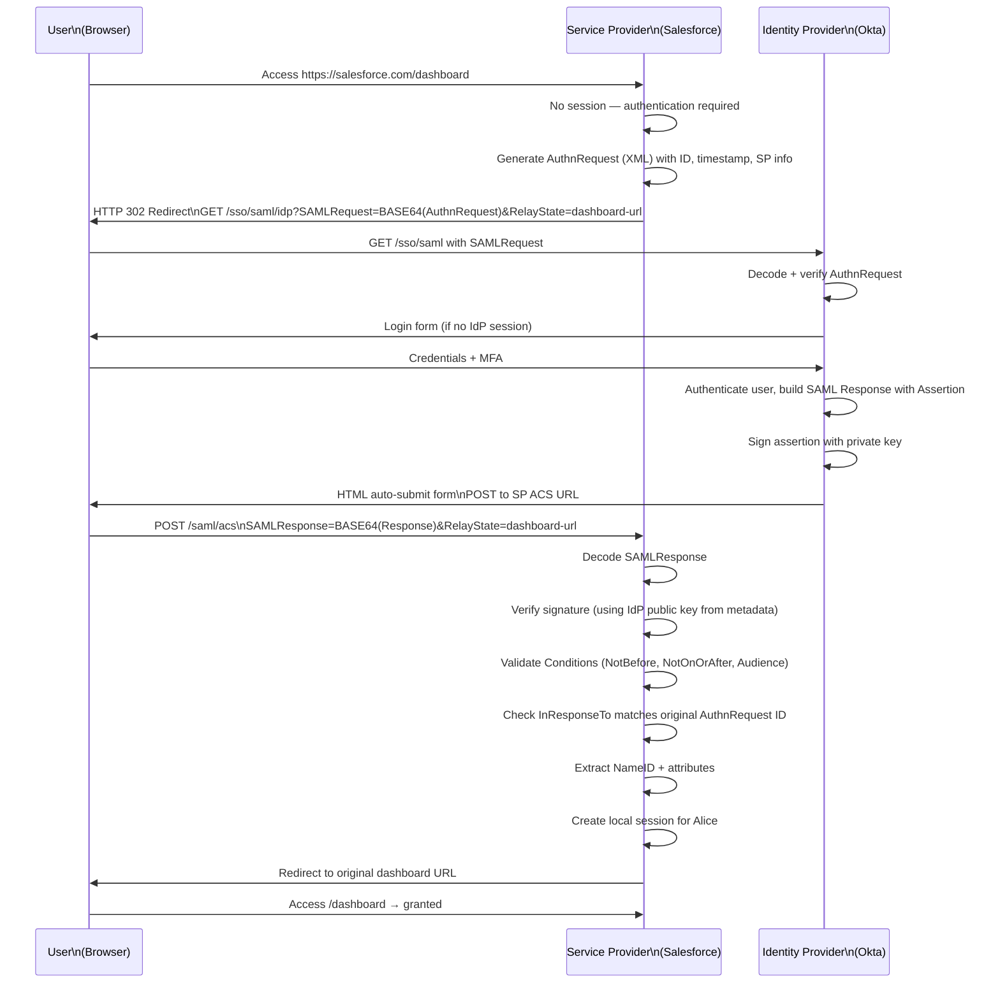
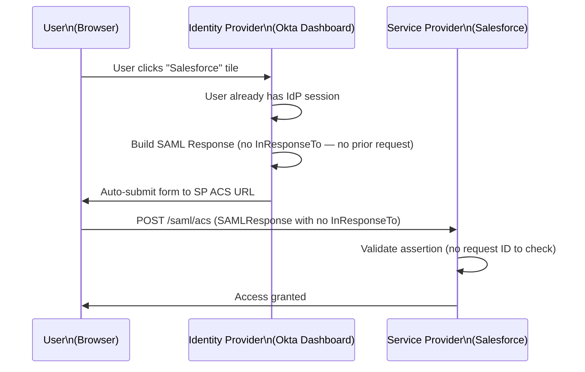
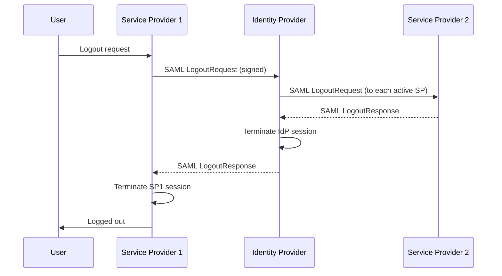

[← Back to README](README.md)

# 07 — SAML 2.0

> **Security Assertion Markup Language (SAML)** is an XML-based open standard for exchanging authentication and authorization data between an Identity Provider and a Service Provider — the dominant enterprise SSO protocol before OIDC.

---

## Table of Contents
- [What is SAML?](#what-is-saml)
- [Core Components](#core-components)
- [SAML Assertions](#saml-assertions)
- [SAML Bindings](#saml-bindings)
- [SAML Flows](#saml-flows)
  - [SP-Initiated SSO](#sp-initiated-sso)
  - [IdP-Initiated SSO](#idp-initiated-sso)
- [SAML Metadata](#saml-metadata)
- [Attribute Statements](#attribute-statements)
- [SAML Signing and Encryption](#saml-signing-and-encryption)
- [Single Logout (SLO)](#single-logout-slo)
- [SAML Security Considerations](#saml-security-considerations)
- [SAML vs OIDC](#saml-vs-oidc)
- [When to Use SAML](#when-to-use-saml)
- [Interview Questions for This Topic](#interview-questions-for-this-topic)

---

## What is SAML?

**SAML 2.0** (published 2005) is an XML-based protocol for federated identity:
- The IdP authenticates users and issues **SAML Assertions** (XML documents)
- The SP receives and trusts these assertions to grant access
- No passwords are exchanged — the SP trusts the IdP's authentication result

**Key fact**: SAML is the dominant protocol in enterprise environments, especially pre-2015. You'll encounter it with legacy SaaS apps, on-premise enterprise software, and government systems.

---

## Core Components

| Component | Description |
|-----------|-------------|
| **Identity Provider (IdP)** | Authenticates the user and issues SAML assertions (e.g., Okta, Azure AD, ADFS) |
| **Service Provider (SP)** | Receives and validates SAML assertions to grant access (e.g., Salesforce, Jira) |
| **SAML Assertion** | XML document from IdP containing user identity + attributes + conditions |
| **SAML Request (AuthnRequest)** | XML document from SP requesting authentication |
| **SAML Response** | XML envelope from IdP containing the assertion |
| **Binding** | Transport mechanism (HTTP POST, HTTP Redirect) |
| **Metadata** | XML document describing IdP or SP endpoints, certificates, and capabilities |

---

## SAML Assertions

A SAML Assertion is an XML document asserting facts about a subject:

```xml
<saml:Assertion
  xmlns:saml="urn:oasis:names:tc:SAML:2.0:assertion"
  ID="_assert-abc123"
  Version="2.0"
  IssueInstant="2024-01-15T10:00:00Z">

  <!-- Who issued this assertion -->
  <saml:Issuer>https://idp.example.com/saml</saml:Issuer>

  <!-- Digital signature for integrity -->
  <ds:Signature xmlns:ds="http://www.w3.org/2000/09/xmldsig#">
    ...
  </ds:Signature>

  <!-- Who this assertion is about -->
  <saml:Subject>
    <saml:NameID Format="urn:oasis:names:tc:SAML:1.1:nameid-format:emailAddress">
      alice@example.com
    </saml:NameID>
    <!-- Limits where this assertion can be used -->
    <saml:SubjectConfirmation Method="urn:oasis:names:tc:SAML:2.0:cm:bearer">
      <saml:SubjectConfirmationData
        NotOnOrAfter="2024-01-15T10:05:00Z"
        Recipient="https://sp.example.com/saml/acs"
        InResponseTo="_request-xyz789"/>
    </saml:SubjectConfirmation>
  </saml:Subject>

  <!-- When this assertion is valid -->
  <saml:Conditions
    NotBefore="2024-01-15T09:55:00Z"
    NotOnOrAfter="2024-01-15T10:05:00Z">
    <!-- Which SP this is for -->
    <saml:AudienceRestriction>
      <saml:Audience>https://sp.example.com/saml</saml:Audience>
    </saml:AudienceRestriction>
  </saml:Conditions>

  <!-- Authentication details -->
  <saml:AuthnStatement AuthnInstant="2024-01-15T09:59:00Z">
    <saml:AuthnContext>
      <saml:AuthnContextClassRef>
        urn:oasis:names:tc:SAML:2.0:ac:classes:PasswordProtectedTransport
      </saml:AuthnContextClassRef>
    </saml:AuthnContext>
  </saml:AuthnStatement>

  <!-- User attributes -->
  <saml:AttributeStatement>
    <saml:Attribute Name="email">
      <saml:AttributeValue>alice@example.com</saml:AttributeValue>
    </saml:Attribute>
    <saml:Attribute Name="firstName">
      <saml:AttributeValue>Alice</saml:AttributeValue>
    </saml:Attribute>
    <saml:Attribute Name="groups">
      <saml:AttributeValue>developers</saml:AttributeValue>
      <saml:AttributeValue>admins</saml:AttributeValue>
    </saml:Attribute>
  </saml:AttributeStatement>

</saml:Assertion>
```

### Three Types of SAML Statements

| Statement | Contains | Purpose |
|-----------|---------|---------|
| **Authentication Statement** | How and when user authenticated | Proves user logged in |
| **Attribute Statement** | User properties (email, name, groups) | Passes profile data to SP |
| **Authorization Decision Statement** | Access decision for specific resource | Rarely used in practice |

### NameID Formats

The `NameID` is how the IdP identifies the user to the SP:

| Format | Value | Use Case |
|--------|-------|---------|
| `emailAddress` | `alice@example.com` | Simple, human-readable |
| `persistent` | `_1234abcd5678efgh` | Opaque, stable per IdP-SP pair — recommended |
| `transient` | Temporary random ID | Anonymous/pseudonymous access |
| `unspecified` | IdP-defined | Legacy |

**Best practice**: Use `persistent` NameID — it doesn't change if the user changes their email.

---

## SAML Bindings

A **binding** defines how SAML messages are transported:

### HTTP Redirect Binding
- SAML message is URL-encoded and sent as a query parameter
- Suitable for **SAML Requests** (AuthnRequest)
- Max URL length limits message size
- Message is **signed** (not encrypted — it's a URL)

```
GET /authorize?SAMLRequest=BASE64DEFLATE(AuthnRequest)&SigAlg=...&Signature=...
```

### HTTP POST Binding
- SAML message is Base64-encoded and sent in an HTML form's hidden field
- Suitable for **SAML Responses** (assertions) — larger messages
- No URL length limit
- Message can be signed and/or encrypted

```html
<form method="POST" action="https://sp.example.com/saml/acs">
  <input type="hidden" name="SAMLResponse" value="BASE64(SAMLResponse)"/>
  <input type="hidden" name="RelayState" value="original-url"/>
  <button type="submit">Submit</button>
</form>
<script>document.forms[0].submit();</script>
```

### HTTP Artifact Binding
- Browser receives only a short reference (artifact)
- SP fetches the actual assertion from IdP server-to-server using SOAP
- More secure (assertion not exposed to browser) but more complex

---

## SAML Flows

### SP-Initiated SSO

The most common flow — user tries to access an SP, gets redirected to IdP.



**ACS (Assertion Consumer Service) URL**: The SP endpoint that receives SAML Responses (HTTP POST). Must be registered in both SP and IdP metadata.

**RelayState**: Opaque value carrying state across the redirect (e.g., the original URL the user tried to access). Limited to 80 bytes.

---

### IdP-Initiated SSO

User starts from the IdP's application portal (e.g., Okta dashboard) and clicks an app tile.



**Security concern**: IdP-initiated SSO is less secure because:
- There is no `InResponseTo` — the assertion was not solicited
- Susceptible to **CSRF-like attacks** — attacker can lure user to accept an unsolicited assertion
- Some SPs refuse IdP-initiated SSO for security reasons

---

## SAML Metadata

Metadata is an XML document that describes an IdP or SP, enabling trust establishment without manual configuration.

### IdP Metadata contains:
- Entity ID (unique identifier)
- SSO endpoint URLs
- SLO endpoint URLs
- X.509 signing certificate (public key for verifying assertions)
- Encryption certificate

### SP Metadata contains:
- Entity ID
- ACS (Assertion Consumer Service) URL
- SLO URL
- X.509 certificate (for encrypting assertions to this SP)
- NameID formats supported
- Required attributes

**Trust establishment flow**:
1. IdP publishes metadata URL
2. SP imports IdP metadata
3. SP publishes metadata URL
4. IdP imports SP metadata
5. Now both parties trust each other

---

## Attribute Statements

Attributes in SAML assertions carry user properties. Common attribute name formats:

```xml
<!-- URN format (SAML-defined) -->
<saml:Attribute Name="urn:oid:0.9.2342.19200300.100.1.3">
  <saml:AttributeValue>alice@example.com</saml:AttributeValue>
</saml:Attribute>

<!-- Friendly name -->
<saml:Attribute Name="email" NameFormat="urn:oasis:names:tc:SAML:2.0:attrname-format:basic">
  <saml:AttributeValue>alice@example.com</saml:AttributeValue>
</saml:Attribute>
```

**Attribute mapping**: The SP may need to map IdP attribute names to its own user schema. E.g.:
- IdP sends: `http://schemas.xmlsoap.org/ws/2005/05/identity/claims/emailaddress`
- SP maps to: `user.email`

---

## SAML Signing and Encryption

### Signing
- IdP signs assertions with its **private key**
- SP verifies with IdP's **public key** (from metadata)
- Prevents assertion tampering
- Can sign the assertion, the response, or both (sign both is recommended)

### Encryption
- SP can encrypt the assertion using SP's **public key** (from SP metadata)
- Only the SP can decrypt with its **private key**
- Optional but recommended when assertions contain sensitive attributes

```
Flow:
IdP generates assertion
  → Signs with IdP private key
  → Encrypts with SP public key
  → Sends to browser (browser sees only ciphertext)
SP receives
  → Decrypts with SP private key
  → Verifies IdP signature with IdP public key
  → Trusts assertion
```

---

## Single Logout (SLO)

**Single Logout** terminates a user's sessions across all SPs when they log out of the IdP (or any SP).



**SLO limitations in practice**:
- Not all SPs support SLO
- Network failures can leave zombie sessions
- Many organizations rely on session TTL instead of SLO
- OIDC has similar issues → See [08 — SSO](08-sso.md)

---

## SAML Security Considerations

| Threat | Description | Mitigation |
|--------|-------------|-----------|
| Assertion replay | Reusing a valid assertion | Check `AssertionID` uniqueness; check `NotOnOrAfter` |
| XML signature wrapping (XSW) | Moving signed assertion inside another element | Use robust XML libraries; validate signed assertion is what's used |
| Man-in-the-middle | Intercepting assertion in transit | HTTPS mandatory; encrypt assertions |
| Forged assertion | Submitting unsigned/self-signed assertion | Always verify IdP signature |
| Open redirect | Malicious RelayState redirecting after login | Validate RelayState is a relative path or known domain |
| IdP impersonation | Attacker pretending to be the IdP | Verify IdP signing certificate matches metadata |
| Audience validation bypass | Accepting assertion meant for another SP | Always check `<Audience>` matches your entity ID |

**XML Signature Wrapping (XSW)** — a particularly nasty SAML-specific attack:
```
Signed assertion: <Assertion ID="A1" user="alice">
Attacker adds:    <Assertion ID="A2" user="admin">
                    <Assertion ID="A1" user="alice"><Signature>...</Signature></Assertion>
                  </Assertion>
Vulnerable parser: "Signature is valid for A1" → uses outer A2 (unsigned) → grants admin!
```
Mitigation: After verifying the signature, use only the element that was signed.

---

## SAML vs OIDC

| Dimension | SAML 2.0 | OIDC |
|-----------|----------|------|
| Year | 2005 | 2014 |
| Format | XML | JSON / JWT |
| Transport | Browser redirect + POST | Browser redirect + API calls |
| Complexity | High | Medium |
| Mobile support | Poor (no native browser redirect) | Excellent |
| API integration | Difficult | Natural |
| Enterprise adoption | Very high (legacy) | Growing rapidly |
| Implementation effort | High | Lower |
| Debugging | Hard (XML parsing, signing) | Easier (JWT, JSON) |
| Feature parity for SSO | Yes | Yes |

**Choose SAML when**:
- SP only supports SAML (legacy enterprise apps, Salesforce classic)
- Your enterprise IdP mandates SAML
- Government/compliance requirements specify SAML

**Choose OIDC when**:
- Building new integrations
- Mobile or SPA clients involved
- API-based identity is needed

→ Full comparison: [10 — Protocols Comparison](10-protocols-comparison.md)

---

## When to Use SAML

SAML remains dominant in:
- Enterprise SaaS (Salesforce, ServiceNow, Workday) — many only support SAML
- Government and regulated industries
- Legacy internal applications integrated with ADFS
- B2B federated identity between large organizations
- When your customers demand SAML (enterprise sales requirement)

---

## Interview Questions for This Topic

1. What is a SAML Assertion and what are its three types of statements?
2. Explain the difference between SP-initiated and IdP-initiated SSO.
3. What is SAML metadata and how does it establish trust between IdP and SP?
4. What is an XML Signature Wrapping attack and how do you prevent it?
5. Why does IdP-initiated SSO have a security disadvantage over SP-initiated SSO?
6. What is the ACS URL and why must it be registered in both places?
7. When would you choose SAML over OIDC in 2026?

→ Full answers in [12 — Interview Q&A](12-interview-qa.md)

---

## Related Topics
- [02 — Identity Concepts](02-identity-concepts.md) — IdP, SP, federation
- [06 — OIDC](06-oidc.md) — Modern alternative to SAML for SSO
- [08 — SSO](08-sso.md) — SAML-based SSO patterns
- [10 — Protocols Comparison](10-protocols-comparison.md) — SAML vs OIDC decision guide
