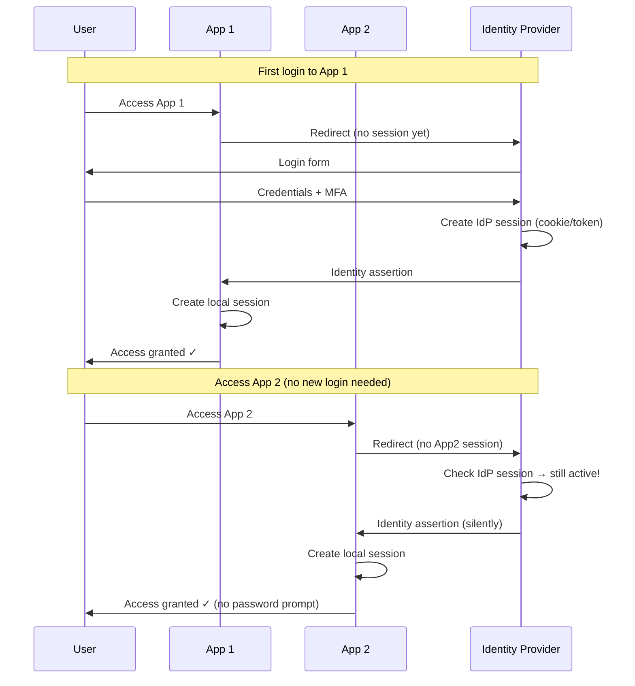
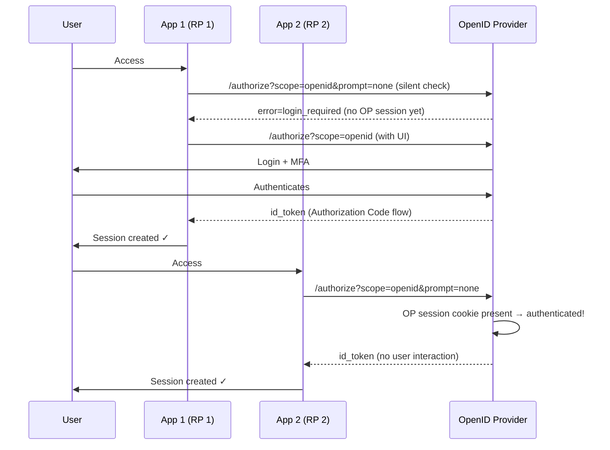
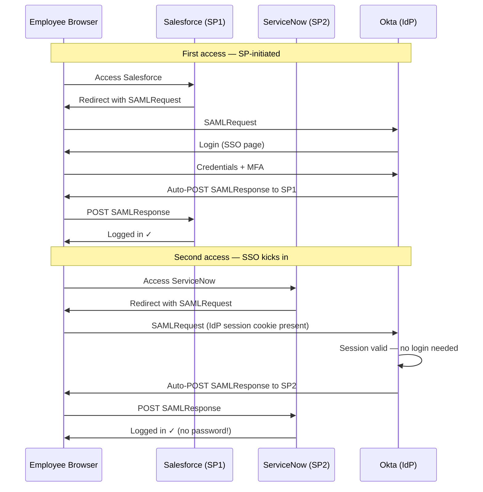
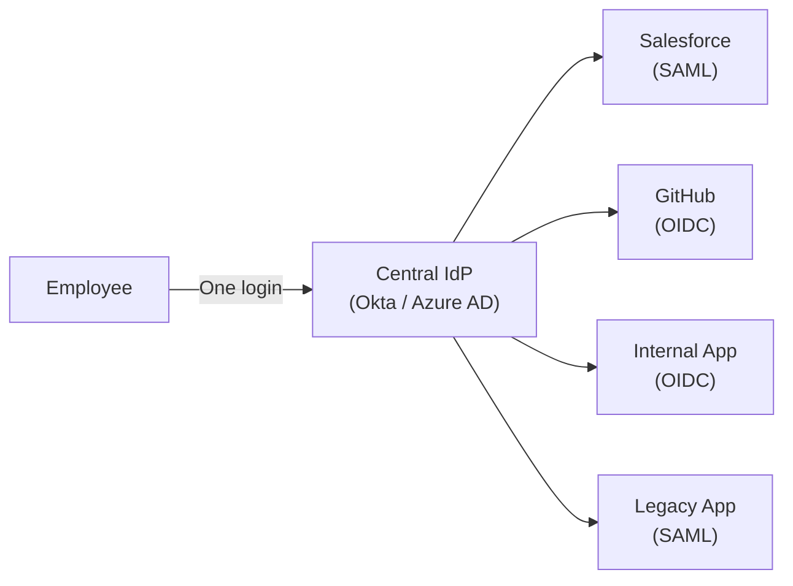
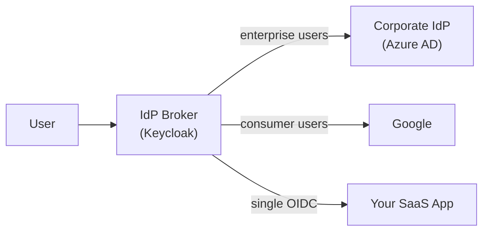
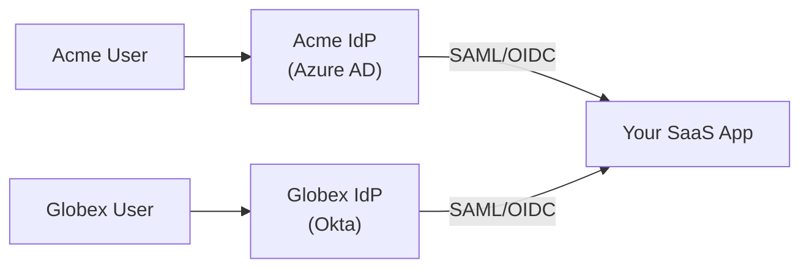
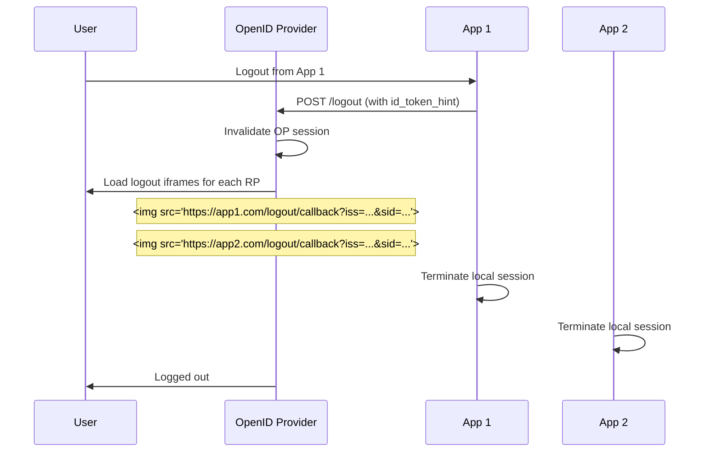
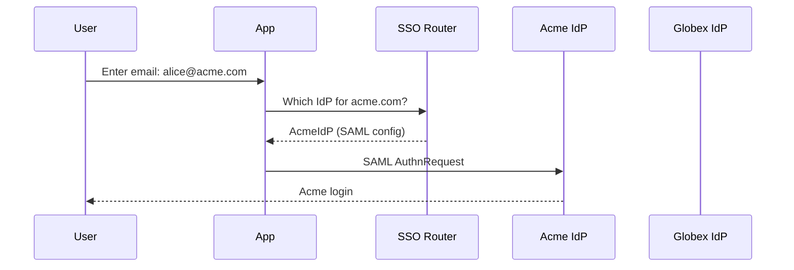
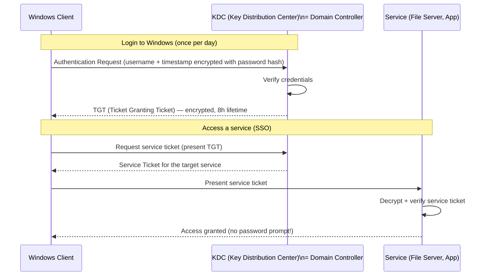

[← Back to README](README.md)

# 08 — Single Sign-On (SSO)

> **Single Sign-On (SSO)** is the ability for a user to authenticate once and gain access to multiple independent systems without re-authenticating for each one.

---

## Table of Contents
- [What is SSO?](#what-is-sso)
- [How SSO Works — The Core Mechanism](#how-sso-works--the-core-mechanism)
- [Types of SSO](#types-of-sso)
- [SSO with OIDC](#sso-with-oidc)
- [SSO with SAML](#sso-with-saml)
- [Enterprise SSO Architecture Patterns](#enterprise-sso-architecture-patterns)
- [Single Logout (SLO)](#single-logout-slo)
- [SSO Session Management](#sso-session-management)
- [SSO Security Considerations](#sso-security-considerations)
- [SSO for SaaS Products (Inbound Federation)](#sso-for-saas-products-inbound-federation)
- [Kerberos SSO](#kerberos-sso)
- [Interview Questions for This Topic](#interview-questions-for-this-topic)

---

## What is SSO?

Without SSO:
- User opens Salesforce → login
- User opens Jira → login
- User opens HR portal → login
- Each app manages its own credentials

With SSO:
- User logs in once to the central IdP
- User opens Salesforce → auto-authenticated via IdP session
- User opens Jira → auto-authenticated
- User opens HR portal → auto-authenticated

**User experience**: One login → many apps.
**Admin experience**: One place to manage identities, enforce MFA, and deprovision users.

---

## How SSO Works — The Core Mechanism



**Key insight**: SSO works because the IdP maintains its own session (usually a browser cookie on the IdP's domain). Each app that needs authentication redirects to the IdP. If the IdP session is active, it issues an assertion silently without prompting the user.

---

## Types of SSO

### Web SSO (Browser-Based)
- Relies on browser redirects and cookies
- Works across multiple web applications in different domains
- Implemented via OIDC, SAML, or WS-Federation
- **Most common type**

### Enterprise SSO (Intranet)
- Windows domain machines authenticate via **Kerberos**
- Users log in to Windows once → all domain-joined apps authenticate automatically
- No browser redirect needed on the same network
- → See [Kerberos SSO](#kerberos-sso)

### Federated SSO (Cross-Organization)
- IdP in Organization A trusts IdP in Organization B
- Users of Org A can access Org B's applications without a separate login
- Implemented via SAML, OIDC, or WS-Federation
- → See [02 — Identity Concepts](02-identity-concepts.md)

### Social Login / Social SSO
- Use Google, Facebook, Apple, Microsoft as the IdP
- Consumer-facing SSO — lower friction signup/login
- Implemented via OIDC

### Mobile SSO
- iOS: Shared keychain, ASWebAuthenticationSession
- Android: Custom tabs, account manager
- Apps on the same device share an authenticated session via the OS

---

## SSO with OIDC

OIDC-based SSO is the modern standard.



### OIDC `prompt` Parameter for SSO

| Value | Behavior |
|-------|---------|
| `prompt=none` | Silent SSO — fail if user not authenticated; no UI shown |
| `prompt=login` | Force re-authentication even if session exists |
| `prompt=consent` | Force consent screen |
| `prompt=select_account` | Show account picker (for multi-account) |

### OIDC `max_age` Parameter
Requires that the authentication happened within the specified number of seconds:
```
max_age=3600  →  user must have authenticated within the last hour
```
If not, OP forces re-authentication (useful for step-up auth).

---

## SSO with SAML

SAML-based SSO in enterprise environments:



---

## Enterprise SSO Architecture Patterns

### Pattern 1: Central IdP (Most Common)



**Advantages**:
- Single point for MFA enforcement
- Immediate deprovisioning (disable in IdP → lose access everywhere)
- Unified audit logs
- One set of credentials to protect

### Pattern 2: IdP Chaining / Broker



Your app integrates once with the broker. The broker handles N upstream IdPs.

### Pattern 3: Multi-IdP (B2B SaaS)



Each enterprise customer brings their own IdP. Your app federates with each customer's IdP separately. → See [11 — Real-World Scenarios](11-real-world-scenarios.md)

---

## Single Logout (SLO)

SLO propagates logout across all apps that share an SSO session.

### SLO with OIDC (Front-Channel Logout — RFC 8705)



**Front-channel logout** (via iframe/URL): Unreliable — depends on browser loading all iframes.

**Back-channel logout** (server-to-server): More reliable — OP calls each RP's logout endpoint directly.

### SLO with SAML

→ Described in detail in [07 — SAML](07-saml.md#single-logout-slo)

### Practical Challenges with SLO

| Challenge | Description |
|-----------|-------------|
| Partial logout | Some apps don't support SLO → zombie sessions |
| Network failures | SLO notification to SP may fail in transit |
| Complexity | Implementing SLO in every SP is significant work |
| Mobile apps | Can't receive browser-based SLO signals |

**Pragmatic alternative**: Short session TTLs (15–30 minutes idle timeout) so sessions naturally expire quickly after logout. Combined with token revocation for critical security events.

---

## SSO Session Management

SSO introduces two distinct session layers:

```
IdP Session (long-lived, IdP's domain)
  └── App 1 Session (shorter-lived, App 1's domain)
  └── App 2 Session (shorter-lived, App 2's domain)
  └── App 3 Session (shorter-lived, App 3's domain)
```

| Session | Lifetime | Managed by |
|---------|---------|------------|
| IdP session | Hours to days | IdP (e.g., Okta 8h, configurable) |
| App local session | Minutes to hours | Each application |

**Session refresh**: Apps can silently refresh their local session by calling the IdP's authorization endpoint with `prompt=none` before the local session expires. If IdP session is still active, a new token is issued silently.

---

## SSO Security Considerations

| Risk | Description | Mitigation |
|------|-------------|-----------|
| Single point of failure | If IdP is down, no one can log in | IdP HA, backup auth methods |
| Account takeover blast radius | Compromising IdP account → all apps | Strong MFA on IdP |
| Session lifetime mismatch | IdP revokes session but app has valid local session | Short app session TTLs; back-channel logout |
| SSO bypass | App has a fallback login form that bypasses IdP | Enforce SSO-only; disable local passwords |
| IdP phishing | User tricked to fake IdP login page | Train users; use FIDO2 (phishing-resistant) |
| Token leakage via redirect | Tokens in URL logs | Use POST binding; PKCE |

---

## SSO for SaaS Products (Inbound Federation)

When building a SaaS product for enterprise customers, you will need to support **customer-managed SSO** (inbound SAML/OIDC).

### Typical Enterprise SSO Feature Requirements

1. **Admin can configure their IdP** (provide EntityID, SSO URL, certificate for SAML; or issuer URL, client_id for OIDC)
2. **Domain-based IdP routing** — detect company from email domain → route to correct IdP
3. **JIT (Just-in-Time) provisioning** — create user account on first SSO login if it doesn't exist
4. **Attribute mapping** — map IdP attributes to app user properties
5. **SSO enforcement** — disable email/password login for SSO-enabled organizations
6. **Multiple IdP support** — one app, N enterprise customers, each with their own IdP

### Email Domain-Based IdP Routing



---

## Kerberos SSO

**Kerberos** is a ticket-based authentication protocol used in Windows domain environments to provide SSO without password re-entry.



**Key concepts**:
| Term | Description |
|------|-------------|
| **KDC** | Key Distribution Center — AS + TGS in one server |
| **AS** | Authentication Service — issues TGT |
| **TGS** | Ticket Granting Service — issues service tickets |
| **TGT** | Ticket Granting Ticket — "master ticket" after initial login |
| **Service Ticket** | Ticket for a specific service |
| **Realm** | Kerberos domain (maps to Windows domain) |
| **SPN** | Service Principal Name — unique service identifier |

**Windows Integrated Authentication**: Apps register an SPN → browsers on domain-joined machines automatically present Kerberos tickets → transparent SSO.

---

## Interview Questions for This Topic

1. How does SSO work mechanically — what happens when a user accesses App 2 after already logging into App 1?
2. What is the difference between IdP session and application session in SSO?
3. What are the security risks of SSO? How would you mitigate the "single point of failure" concern?
4. What is front-channel vs back-channel logout?
5. How would you architect SSO for a SaaS product that needs to support enterprise customers' own IdPs?
6. What is JIT provisioning and why is it needed?
7. How does Kerberos achieve SSO in a Windows environment?

→ Full answers in [12 — Interview Q&A](12-interview-qa.md)

---

## Related Topics
- [02 — Identity Concepts](02-identity-concepts.md) — IdP, federation concepts
- [06 — OIDC](06-oidc.md) — Modern SSO protocol
- [07 — SAML](07-saml.md) — Enterprise SSO protocol
- [11 — Real-World Scenarios](11-real-world-scenarios.md) — B2B SSO architecture
