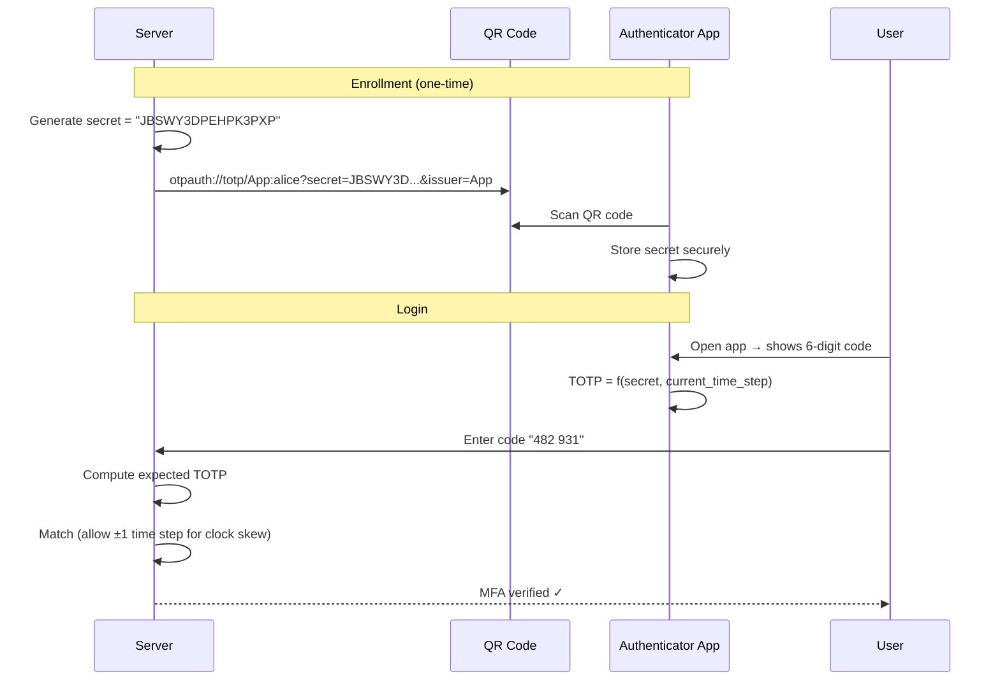
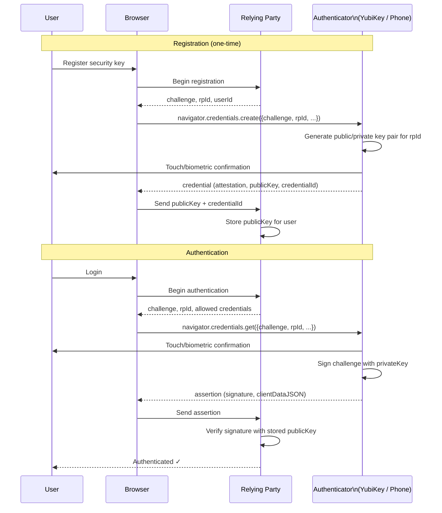
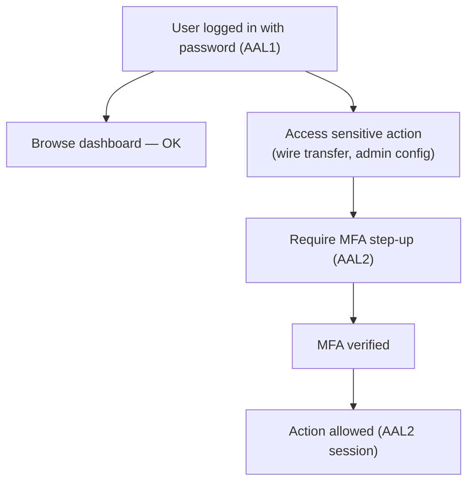

[← Back to README](README.md)

# 09 — Multi-Factor Authentication (MFA / 2FA)

> MFA requires users to present two or more independent factors of authentication, drastically reducing the risk of account compromise even when one factor (typically a password) is stolen.

---

## Table of Contents
- [Why MFA Matters](#why-mfa-matters)
- [Authentication Factors Recap](#authentication-factors-recap)
- [MFA Methods](#mfa-methods)
  - [SMS OTP](#sms-otp)
  - [TOTP — Time-Based One-Time Password](#totp--time-based-one-time-password)
  - [HOTP — HMAC-Based One-Time Password](#hotp--hmac-based-one-time-password)
  - [Push Notifications](#push-notifications)
  - [Email OTP](#email-otp)
  - [Hardware Tokens](#hardware-tokens)
  - [FIDO2 / WebAuthn](#fido2--webauthn)
  - [Passkeys](#passkeys)
- [Biometrics](#biometrics)
- [Step-Up Authentication](#step-up-authentication)
- [MFA in OAuth 2.0 and OIDC](#mfa-in-oauth-20-and-oidc)
- [Adaptive / Risk-Based Authentication](#adaptive--risk-based-authentication)
- [MFA Attacks and Mitigations](#mfa-attacks-and-mitigations)
- [Interview Questions for This Topic](#interview-questions-for-this-topic)

---

## Why MFA Matters

Statistics:
- Over 80% of hacking-related breaches involve compromised credentials
- MFA blocks **99.9% of automated attacks** (Microsoft data)
- SMS-based MFA is better than nothing but phishable; FIDO2 is phishing-resistant

**The threat model**: A password alone can be:
- Phished
- Brute-forced
- Stolen from a data breach (credential stuffing)
- Guessed from social engineering

Adding a second factor means an attacker needs to compromise two independent things simultaneously.

---

## Authentication Factors Recap

| Factor Type | Examples | Phishable? |
|-------------|---------|-----------|
| Something you know | Password, PIN, security questions | Yes |
| Something you have | Phone (TOTP app), hardware key, smart card | Partially (SMS/OTP yes; FIDO2 no) |
| Something you are | Fingerprint, face, iris | No (but can be coerced) |
| Somewhere you are | IP geolocation, GPS | Circumventable with VPN |
| Something you do | Typing speed, mouse behavior | Hard to spoof |

**True MFA** = two factors from **different categories**.

---

## MFA Methods

### SMS OTP

User receives a 6-digit code via SMS after entering their password.

**Flow**:
1. User enters username + password
2. Server sends SMS with code to registered phone number
3. User enters code within 5–10 minutes

**Pros**:
- Ubiquitous — any phone can receive SMS
- No app installation required
- User-familiar

**Cons and Risks**:
| Risk | Description |
|------|-------------|
| **SIM swapping** | Attacker convinces carrier to transfer victim's number to attacker's SIM |
| **SS7 attacks** | Telecom protocol vulnerabilities allow OTP interception |
| **Phishing** | Real-time phishing sites can collect and replay OTPs |
| **Social engineering** | Attacker calls victim pretending to be support |

**Verdict**: Better than no MFA. Not acceptable for high-security applications. Many compliance frameworks (PCI-DSS v4, NIST 800-63B) no longer recommend SMS OTP.

---

### TOTP — Time-Based One-Time Password

**RFC 6238** — codes generated by an authenticator app (Google Authenticator, Authy, Microsoft Authenticator).

**How it works**:

```
Shared setup:
  Server generates 16-byte random secret (BASE32 encoded)
  Secret is shared once via QR code scan

Code generation (every 30 seconds):
  T = floor(current_unix_time / 30)  ← time step
  TOTP = HOTP(secret, T)
       = HMAC-SHA1(secret, T) → truncate to 6 digits
```



**Pros**:
- Works offline — no network needed during verification
- No per-code network call to third party
- Open standard — interoperable apps

**Cons**:
- Phishable — real-time phishing sites can relay codes
- Secret loss = lockout (must have recovery codes)
- 30-second window for replay

**Time step tolerance**: Most implementations accept ±1 time step (±30 seconds) to accommodate clock drift.

---

### HOTP — HMAC-Based One-Time Password

**RFC 4226** — counter-based (not time-based). Code advances by counter, not time.

```
HOTP(secret, counter) = HMAC-SHA1(secret, counter) → 6 digits
```

Used in: Hardware tokens (RSA SecurID, YubiKey OTP)

**Difference from TOTP**:
| | TOTP | HOTP |
|--|------|------|
| Trigger | Time (every 30s) | Button press / counter |
| Synchronization | Time sync needed | Counter sync needed |
| Replay window | 30 seconds | Until next use |

---

### Push Notifications

Server sends a push notification to the user's registered mobile app (Duo, Okta Verify, Microsoft Authenticator).

**Flow**:
1. User enters password
2. Server sends push to user's phone: "Approve login from New York?"
3. User taps Approve or Deny

**Pros**:
- User-friendly — no code to type
- Context-aware — can show IP address, location, app name
- Can require biometric to approve

**Cons**:
- Requires internet on phone
- Susceptible to **MFA fatigue (push bombing)**

---

### Email OTP

Code sent via email. Weaker than SMS OTP because email accounts are frequently compromised. Generally not recommended as a sole MFA factor for high-security systems.

---

### Hardware Tokens

Physical devices that generate OTPs:
- **RSA SecurID**: Generates TOTP-like codes; proprietary
- **YubiKey OTP**: Generates one-time passwords (custom Yubico format)

More secure than software TOTP — cannot be phished remotely (requires physical token).

---

### FIDO2 / WebAuthn

**FIDO2** is the most secure, phishing-resistant MFA standard today.

**Components**:
| Component | Description |
|-----------|-------------|
| **FIDO2** | Umbrella standard combining WebAuthn + CTAP |
| **WebAuthn** | W3C web API for web browsers to interact with authenticators |
| **CTAP** | Client-to-Authenticator Protocol — communication between browser/OS and hardware key |
| **Authenticator** | Device that holds the private key (hardware key, phone, platform authenticator) |

**How FIDO2 Works**:



**Why FIDO2 is phishing-resistant**:
- The **Relying Party ID (rpId)** = origin (domain) is cryptographically bound to the key
- A key registered for `bank.com` will NOT work on `fakebank.com`
- Even if user is tricked to a phishing site, their authenticator refuses to sign for a different origin

**Authenticator types**:
| Type | Examples | Security Level |
|------|---------|---------------|
| Roaming/Cross-Platform | YubiKey, Google Titan, Feitian | Highest |
| Platform (built-in) | Touch ID, Face ID, Windows Hello, Android biometric | High |
| Software | Password manager (Bitwarden, 1Password with passkey support) | Good |

---

### Passkeys

**Passkeys** are FIDO2 credentials synchronized via the cloud (iCloud Keychain, Google Password Manager, Windows). They make FIDO2 accessible to mainstream users.

```
Traditional FIDO2: Tied to one hardware key → lost = locked out
Passkey:          Synced across your devices → lost phone ≠ locked out
```

**Types**:
- **Synced passkeys**: Stored in cloud (iCloud, Google) — convenient, highest adoption
- **Device-bound passkeys**: Stored on one device — higher security, less convenient

**Passkeys as password replacement**: Login with just biometrics + passkey (no password).

```
User visits bank.com
  → Prompted for passkey
  → Verifies with Face ID
  → Signed challenge sent to server
  → Authenticated ✓ (no password typed)
```

---

## Biometrics

Biometric authentication (`something you are`):

| Modality | Examples | FRR | FAR | Notes |
|----------|---------|-----|-----|-------|
| Fingerprint | Touch ID, most phones | ~0.1% | ~0.001% | Most common |
| Face | Face ID, Windows Hello | ~0.1% | ~0.001% | Spoofable with photos (old systems) |
| Iris | High-security, government | Very low | Very low | Expensive hardware |
| Voice | Some banking apps | Higher | Higher | Affected by illness/noise |

**FRR** (False Rejection Rate): Legitimate user rejected
**FAR** (False Acceptance Rate): Attacker accepted

**Important**: On-device biometrics (Touch ID, Face ID) never send biometric data to servers. The biometric unlocks the local key store/secure enclave which then performs the cryptographic operation.

---

## Step-Up Authentication

**Step-up authentication** requires re-authentication at a higher assurance level when a user tries to perform a sensitive action.



**NIST SP 800-63B Authentication Assurance Levels**:

| Level | Assurance Level | Requirements |
|-------|-----------------|-------------|
| AAL1 | Low | Single factor; password |
| AAL2 | Medium | Two factors; TOTP or hardware key |
| AAL3 | High | Hardware-based key (FIDO2); verifier impersonation resistance |

**In OIDC**: Request step-up using `acr_values` (Authentication Context Class Reference):
```
GET /authorize?acr_values=urn:mace:incommon:iap:silver  (AAL2)
```

---

## MFA in OAuth 2.0 and OIDC

MFA is enforced at the IdP/Authorization Server — the OAuth 2.0 client doesn't implement MFA itself:

```
1. Client redirects to Authorization Server
2. AS handles authentication (including MFA)
3. AS issues tokens only after MFA is satisfied
4. ID token may include:
     amr (Authentication Methods References): ["pwd", "otp"]
     acr (Authentication Context Class Reference): "urn:mace:incommon:iap:silver"
```

| Claim | Description | Example |
|-------|-------------|---------|
| `amr` | Methods used to authenticate | `["pwd", "mfa", "hwk"]` |
| `acr` | Assurance level met | `"urn:mace:incommon:iap:silver"` |
| `auth_time` | When authentication occurred | Unix timestamp |

---

## Adaptive / Risk-Based Authentication

Instead of always requiring MFA, risk-based auth evaluates context and requires MFA only when risk is elevated:

| Signal | Low Risk | High Risk |
|--------|---------|---------|
| IP location | Known location | New country |
| Device | Known, enrolled device | New device |
| Time of day | Normal business hours | 3 AM |
| Behavior | Normal access pattern | Unusual large download |
| Velocity | Normal | 10 logins in 5 minutes |

**Decision**:
```
Risk Score Low  → Allow with just password
Risk Score Med  → Require TOTP or push
Risk Score High → Require FIDO2 or block
```

Used by: Okta Adaptive MFA, Microsoft Entra Conditional Access, Duo Risk-Based Authentication.

---

## MFA Attacks and Mitigations

| Attack | Description | Mitigation |
|--------|-------------|-----------|
| **MFA fatigue (push bombing)** | Attacker sends 100s of push notifications until user approves | Number matching in push (user must enter number shown on screen); rate limiting |
| **Real-time phishing** | Phishing site relays OTP to real site in real time | FIDO2 (origin-bound); user education |
| **SIM swapping** | Port victim's number to attacker's SIM | Don't use SMS MFA; use TOTP or FIDO2 |
| **SS7 attack** | Intercept SMS via telecom protocol exploit | Don't use SMS for high-security systems |
| **OTP interception** | Malware reads OTP from device | FIDO2 (no OTP to steal) |
| **Social engineering** | Attacker calls pretending to be IT support, asks for OTP | User training; FIDO2 |
| **Account recovery bypass** | Attacker uses "forgot password" to bypass MFA | MFA required on password reset flow too |

---

## Interview Questions for This Topic

1. What is the difference between TOTP and HOTP?
2. Why is SMS OTP considered weak? What attacks does it not prevent?
3. How does FIDO2 prevent phishing? Explain the cryptographic mechanism.
4. What are passkeys and how do they differ from traditional FIDO2?
5. What is MFA fatigue and how does number matching mitigate it?
6. What is step-up authentication and how would you implement it?
7. What does the `amr` claim in a JWT represent?
8. What is the difference between AAL1, AAL2, and AAL3?

→ Full answers in [12 — Interview Q&A](12-interview-qa.md)

---

## Related Topics
- [01 — Authentication vs Authorization](01-authn-vs-authz.md)
- [04 — JWT](04-jwt.md) — `amr` and `acr` claims
- [06 — OIDC](06-oidc.md) — How MFA integrates with OIDC
- [08 — SSO](08-sso.md) — MFA enforcement at IdP level
