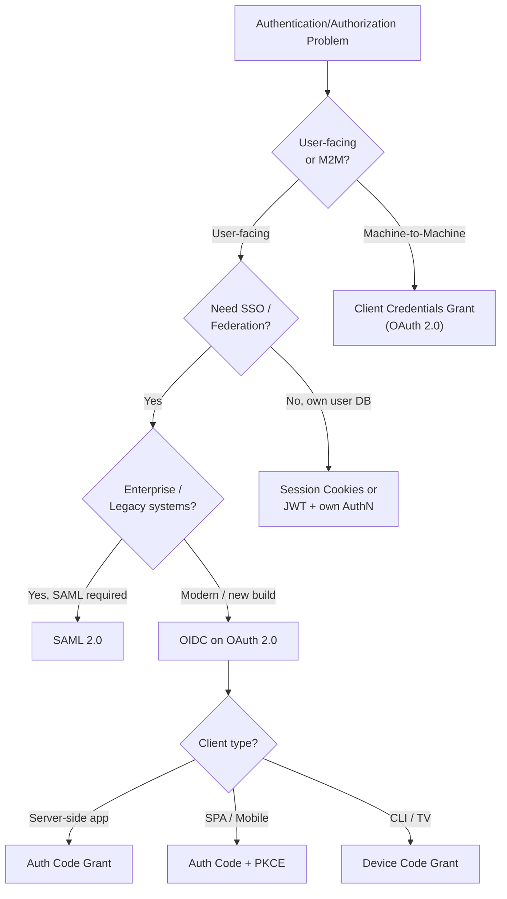
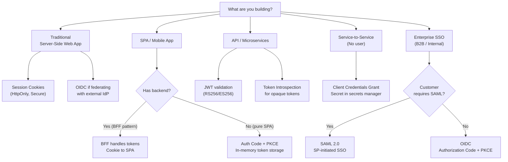

[← Back to README](README.md)

# 10 — Protocols Comparison

> A quick-reference guide to compare Session Auth, JWT, OAuth 2.0, OIDC, and SAML — and a decision framework for choosing the right approach.

---

## Table of Contents
- [The Big Picture](#the-big-picture)
- [Side-by-Side Comparison](#side-by-side-comparison)
- [When to Use What — Decision Flowchart](#when-to-use-what--decision-flowchart)
- [Token Formats Comparison](#token-formats-comparison)
- [SSO Protocol Comparison: OIDC vs SAML](#sso-protocol-comparison-oidc-vs-saml)
- [Grant Types Quick Reference](#grant-types-quick-reference)
- [Access Control Models Comparison](#access-control-models-comparison)
- [Common Misuse Patterns](#common-misuse-patterns)
- [Migration Paths](#migration-paths)
- [Interview Questions for This Topic](#interview-questions-for-this-topic)

---

## The Big Picture

---

## Side-by-Side Comparison

| Dimension | Session Auth | JWT (stateless) | OAuth 2.0 | OIDC | SAML 2.0 |
|-----------|-------------|-----------------|-----------|------|----------|
| **Primary Purpose** | Web app session | Token format/transport | Delegated authorization | Authentication (federated) | Authentication (federated) |
| **Answers** | Are you logged in? | Who are you? (with signature) | What can this app access? | Who is this user? | Who is this user? |
| **Year** | — | 2010 (RFC) | 2012 | 2014 | 2005 |
| **Format** | Server-side state + cookie | JSON + Base64URL | JSON (tokens) | JSON + JWT | XML |
| **Statefulness** | Stateful | Stateless | Stateless (access token) | Stateless | Stateless |
| **User identity** | In session store | In token payload | Not defined | ID Token | SAML Assertion |
| **Mobile support** | Poor | Good | Excellent | Excellent | Poor |
| **API integration** | Difficult | Good | Excellent | Excellent | Difficult |
| **Implementation complexity** | Low | Medium | Medium | Medium | High |
| **Enterprise adoption** | High (legacy) | High | High | Growing | Very high (legacy) |
| **Revocation** | Easy (delete session) | Hard (wait for expiry) | Refresh token revocation | Same as OAuth 2.0 | Session timeout |
| **Offline support** | No | Yes | No (can't refresh) | No | No |

---

## When to Use What — Decision Flowchart

---

## Token Formats Comparison

| | Session ID | JWT (JWS) | JWE | SAML Assertion |
|--|-----------|-----------|-----|----------------|
| Format | Opaque random string | Base64URL JSON | Encrypted JSON | XML |
| Size | Small (~128 bits) | Medium (few KB) | Larger | Large (several KB) |
| Self-contained | No (needs store lookup) | Yes | Yes | Yes |
| Human-readable | No | **Yes (decoded)** | No | With XML parser |
| Encrypted by default | No | No | Yes | Optional |
| Signed | No | Yes | Yes (inner JWS) | Yes (XML dsig) |
| Revocable | Immediately | Not until expiry | Not until expiry | Not until expiry |

---

## SSO Protocol Comparison: OIDC vs SAML

| Dimension | OIDC | SAML 2.0 |
|-----------|------|----------|
| Foundation | OAuth 2.0 | Standalone XML spec |
| Token format | JWT | XML assertion |
| Token size | Compact | Large |
| Transport | HTTPS redirect + JSON API | Browser redirect + form POST |
| Mobile/native apps | Native support | Awkward |
| API access | Natural (same access_token) | Not designed for APIs |
| Setup complexity | Medium | High |
| Debugging | Easier (JWT, JSON) | Harder (XML signing) |
| Metadata | JSON discovery document | XML metadata file |
| Key distribution | JWKS endpoint (JSON) | X.509 certs in XML metadata |
| Standardized user info | UserInfo endpoint | Attribute statements (custom) |
| Browser dependency | Low | High (redirect + POST) |
| Enterprise support | Growing (all major IdPs) | Universal (all enterprise IdPs) |
| Attribute mapping | Standard claim names | Custom attribute names (varies) |
| SSO logout | Front/back-channel logout | SLO (SOAP or redirect) |
| When to choose | New builds, modern apps, mobile | Legacy enterprise apps, when SP requires SAML |

---

## Grant Types Quick Reference

| Grant Type | Who | Flow | When |
|-----------|-----|------|------|
| **Authorization Code** | Confidential clients (server-side) | Redirect → code → token | Web apps with server backend |
| **Authorization Code + PKCE** | Public or confidential clients | Redirect → code + PKCE → token | SPAs, mobile apps, all modern clients |
| **Client Credentials** | Machine (no user) | Credential → token | M2M, background services |
| **Device Code** | Limited-input devices | Device polls until user approves on phone | Smart TV, CLI tools, IoT |
| **Refresh Token** | Any client | Refresh token → new access token | Extending sessions without re-login |
| ~~Implicit~~ | ~~Browser JS~~ | ~~Redirect → token directly~~ | ~~Deprecated — use PKCE instead~~ |
| ~~ROPC~~ | ~~Trusted first-party~~ | ~~Credentials → token~~ | ~~Deprecated — never use~~ |

---

## Access Control Models Comparison

| Model | Basis | Flexibility | Complexity | Best For |
|-------|-------|------------|------------|---------|
| **ACL** | Per-resource user lists | Low | Low | File systems, simple resources |
| **RBAC** | Roles → permissions | Medium | Low-Medium | Most enterprise apps |
| **ABAC** | Attributes (user + resource + env) | High | High | Complex contextual policies |
| **PBAC** | Declarative policies (OPA, Cedar) | Very High | High | Cloud-native, microservices |
| **ReBAC** | Relationship graph | High | Medium | Google Drive-like sharing |

---

## Common Misuse Patterns

| Anti-Pattern | Problem | Correct Approach |
|-------------|---------|-----------------|
| **Using OAuth for authentication** | OAuth only gives access; doesn't tell you *who* the user is | Add OIDC (`openid` scope) to get ID token |
| **Validating access token as ID token** | Access token `aud` may not be your client | Validate ID token separately; use access token only for APIs |
| **Not validating `aud` claim** | Token meant for another service accepted by yours | Always check `aud` |
| **Not validating `iss` claim** | Token from a different IdP accepted | Always check `iss` |
| **Storing JWT in localStorage** | XSS can steal it | Use HttpOnly cookies or in-memory storage |
| **Using Implicit grant for SPA** | Token in URL — exposed in logs/history | Use Authorization Code + PKCE |
| **Long-lived access tokens** | Revocation is impossible | Keep access tokens short (5–15 min) |
| **Not rotating refresh tokens** | Stolen refresh token usable forever | Implement refresh token rotation |
| **HS256 in multi-service setup** | All services share secret → blast radius | Use RS256/ES256 with public JWKS |
| **Trusting JWT without signature verification** | Attacker can forge any claims | Always verify signature before trusting claims |
| **Using ROPC grant** | Client receives passwords | Migrate to Authorization Code + PKCE |

---

## Migration Paths

### From Session Auth to JWT + OAuth 2.0

1. Set up an Authorization Server (Keycloak, Auth0, or build one)
2. Keep session auth for existing web pages — run both in parallel
3. Migrate API endpoints to accept Bearer tokens
4. Add PKCE flow for SPA/mobile clients
5. Phase out session auth for API endpoints
6. Keep session auth or add OIDC for server-side pages

### From Implicit Grant to Authorization Code + PKCE

1. Verify your Authorization Server supports PKCE
2. Update client registration: add PKCE capability, remove implicit
3. Update client code: generate code_verifier/code_challenge
4. Test token exchange
5. Remove Implicit grant from AS configuration

### From SAML to OIDC

1. Check if OIDC is supported by your IdP (usually yes for modern IdPs)
2. Register OIDC client at IdP (get client_id, configure redirect URI)
3. Implement OIDC flow in application (or use library)
4. Map OIDC claims → your user schema
5. Run OIDC parallel to SAML for a period
6. Migrate users, then decommission SAML config

### From Flat RBAC to ABAC

1. Identify policies that are currently hard-coded role checks with added conditionals
2. Extract these into ABAC policies using an engine (OPA, Casbin)
3. Start with the most complex/dynamic policies; keep simple role checks as-is
4. Centralize policy evaluation (don't duplicate across services)
5. Add policy testing alongside unit tests

---

## Interview Questions for This Topic

1. A user complains that they have to log in to each application separately. What technology would you implement and why?
2. Your SaaS product needs to support enterprise customers' existing IdPs. Would you implement SAML, OIDC, or both?
3. You're building a mobile app. Which OAuth 2.0 grant type should you use and why?
4. What is the difference between OAuth 2.0 and OIDC? Can you use OAuth without OIDC for login?
5. When would you choose ABAC over RBAC?
6. Your access tokens are long-lived (24 hours). What risks does this introduce and how would you address them?

→ Full answers in [12 — Interview Q&A](12-interview-qa.md)

---

## Related Topics
- [05 — OAuth 2.0](05-oauth2.md) — Grant types in depth
- [06 — OIDC](06-oidc.md) — OIDC deep dive
- [07 — SAML](07-saml.md) — SAML deep dive
- [11 — Real-World Scenarios](11-real-world-scenarios.md) — Applying these choices in practice
