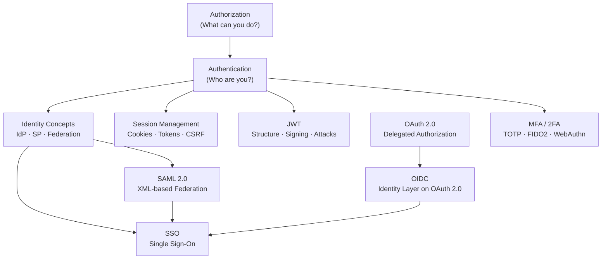
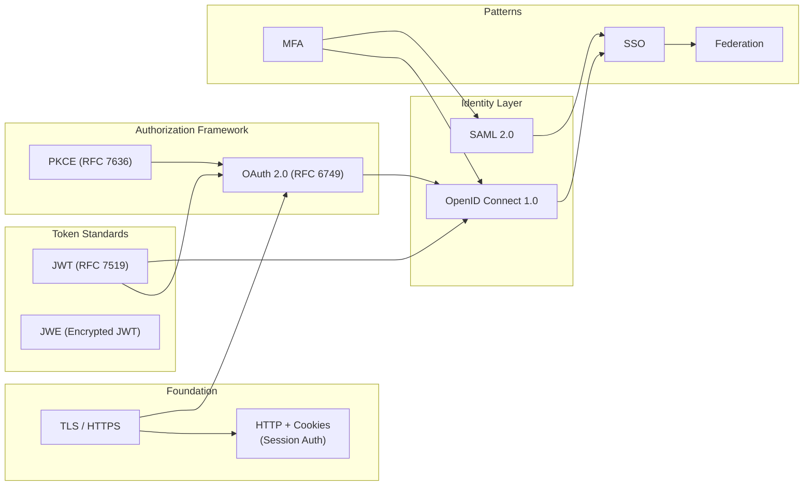

# Authentication & Authorization — Senior Developer Study Guide

> A comprehensive, interview-ready reference covering every major auth/identity concept.
> Each topic is a standalone file with cross-links for non-linear navigation.

---

## Concept Map

---

## Navigation Table

| # | File | What You Will Learn |
|---|------|---------------------|
| — | **You are here** | Overview, concept map, reading order |
| 01 | [Authentication vs Authorization](01-authn-vs-authz.md) | Definitions, RBAC, ABAC, ACL, PBAC, real-world analogies |
| 02 | [Identity Concepts](02-identity-concepts.md) | IdP, SP, Relying Party, Federation, LDAP, Active Directory, Azure AD |
| 03 | [Session Management](03-session-management.md) | Sessions, cookies, sliding/absolute expiry, CSRF, SameSite, token storage |
| 04 | [JWT](04-jwt.md) | Header/payload/signature, HS256/RS256/ES256, `none` alg attack, JWE vs JWS |
| 05 | [OAuth 2.0](05-oauth2.md) | Auth Code + PKCE, Client Credentials, Device Code, scopes, refresh tokens |
| 06 | [OpenID Connect (OIDC)](06-oidc.md) | ID Token, UserInfo endpoint, discovery document, how OIDC extends OAuth 2.0 |
| 07 | [SAML 2.0](07-saml.md) | XML assertions, SP/IdP-initiated flows, POST/Redirect binding, metadata |
| 08 | [Single Sign-On (SSO)](08-sso.md) | Federated SSO, enterprise SSO, SLO, SSO with OIDC and SAML |
| 09 | [MFA / 2FA](09-mfa.md) | TOTP/HOTP, SMS OTP risks, FIDO2, WebAuthn, passkeys, step-up auth |
| 10 | [Protocols Comparison](10-protocols-comparison.md) | OAuth vs OIDC vs SAML vs Sessions — decision guide |
| 11 | [Real-World Scenarios](11-real-world-scenarios.md) | Enterprise B2B, SaaS multi-tenant, microservices, attack vectors |
| 12 | [Interview Q&A](12-interview-qa.md) | 60+ curated questions with interview-ready answers |

---

## Recommended Reading Order

### If you are new to the topic
1. [01 — Authentication vs Authorization](01-authn-vs-authz.md)
2. [02 — Identity Concepts](02-identity-concepts.md)
3. [03 — Session Management](03-session-management.md)
4. [04 — JWT](04-jwt.md)
5. [05 — OAuth 2.0](05-oauth2.md)
6. [06 — OIDC](06-oidc.md)
7. [07 — SAML](07-saml.md)
8. [08 — SSO](08-sso.md)
9. [09 — MFA](09-mfa.md)
10. [10 — Protocols Comparison](10-protocols-comparison.md)
11. [11 — Real-World Scenarios](11-real-world-scenarios.md)
12. [12 — Interview Q&A](12-interview-qa.md)

### If you are refreshing before an interview
- Start with [10 — Protocols Comparison](10-protocols-comparison.md) for a fast overview
- Then [12 — Interview Q&A](12-interview-qa.md)
- Deep-dive into any weak areas using the specific files above

### If you are preparing for enterprise/cloud roles
- Focus on [02 — Identity Concepts](02-identity-concepts.md), [07 — SAML](07-saml.md), [08 — SSO](08-sso.md), [11 — Real-World Scenarios](11-real-world-scenarios.md)

---

## Key Terminology Cheat Sheet

| Term | One-line Definition |
|------|---------------------|
| **Authentication (AuthN)** | Verifying *who* you are |
| **Authorization (AuthZ)** | Deciding *what* you can do |
| **IdP** | Identity Provider — issues identity tokens |
| **SP / RP** | Service Provider / Relying Party — consumes identity tokens |
| **OAuth 2.0** | Framework for *delegated authorization* (not authentication) |
| **OIDC** | Identity layer built on top of OAuth 2.0 — adds authentication |
| **SAML** | XML-based protocol for enterprise SSO and federated identity |
| **SSO** | Single Sign-On — one login, many applications |
| **JWT** | JSON Web Token — compact, self-contained credential format |
| **MFA** | Multi-Factor Authentication — more than one proof of identity |
| **PKCE** | Proof Key for Code Exchange — protects public OAuth clients |
| **RBAC** | Role-Based Access Control |
| **ABAC** | Attribute-Based Access Control |
| **Federation** | Trusting an external IdP to authenticate users for your system |

---

## How These Protocols Relate

---

## About This Guide

- **Target audience**: Software engineers preparing for senior/staff developer interviews
- **Coverage**: Concepts, protocols, flows, security considerations, and real-world usage
- **Format**: Each file is self-contained and cross-linked for both sequential and random-access reading
- **Diagrams**: Mermaid sequence/flow diagrams are embedded throughout for visual learners
